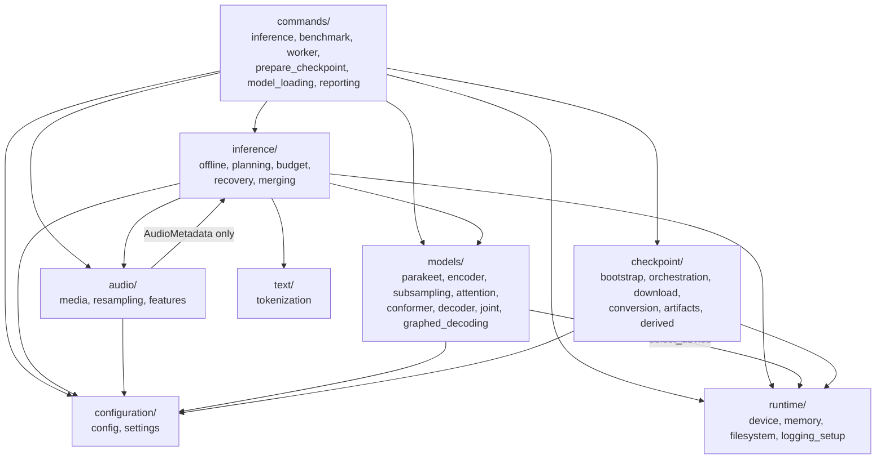
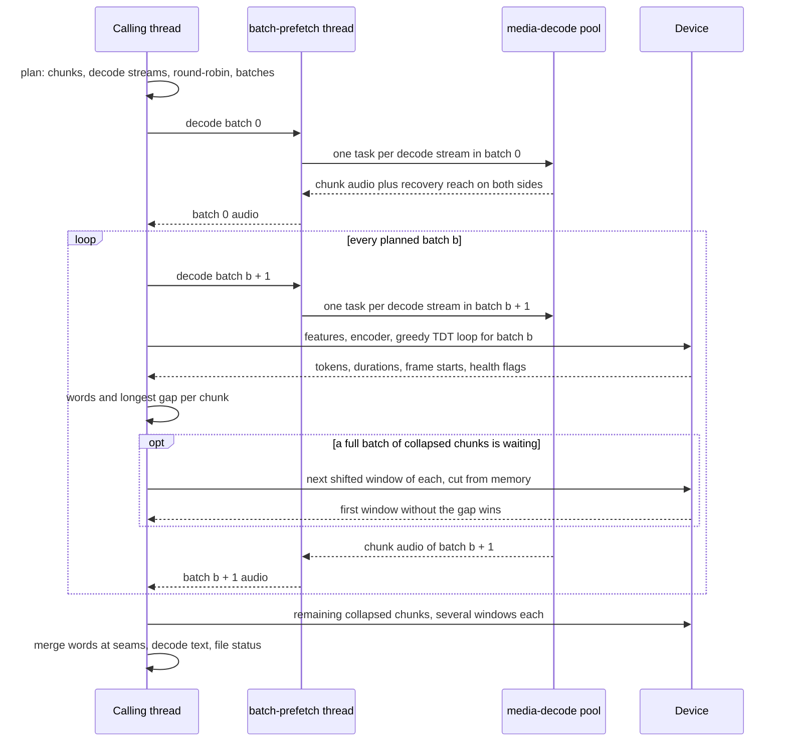
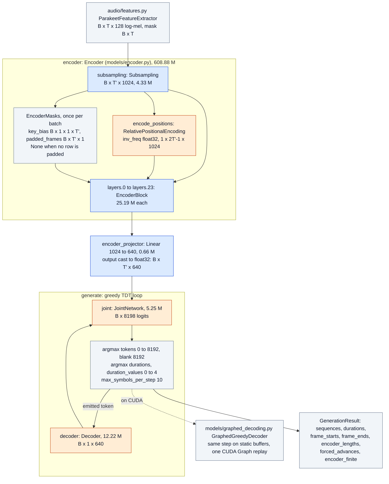
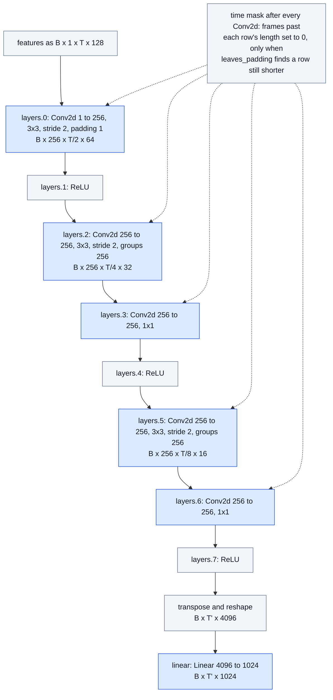
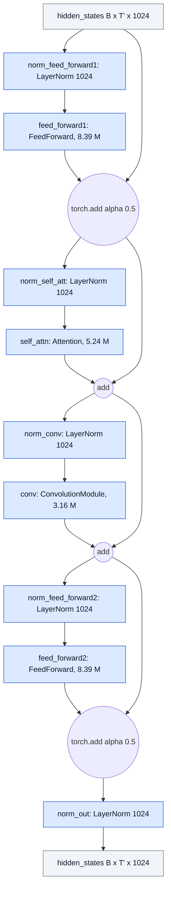
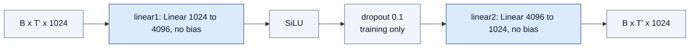
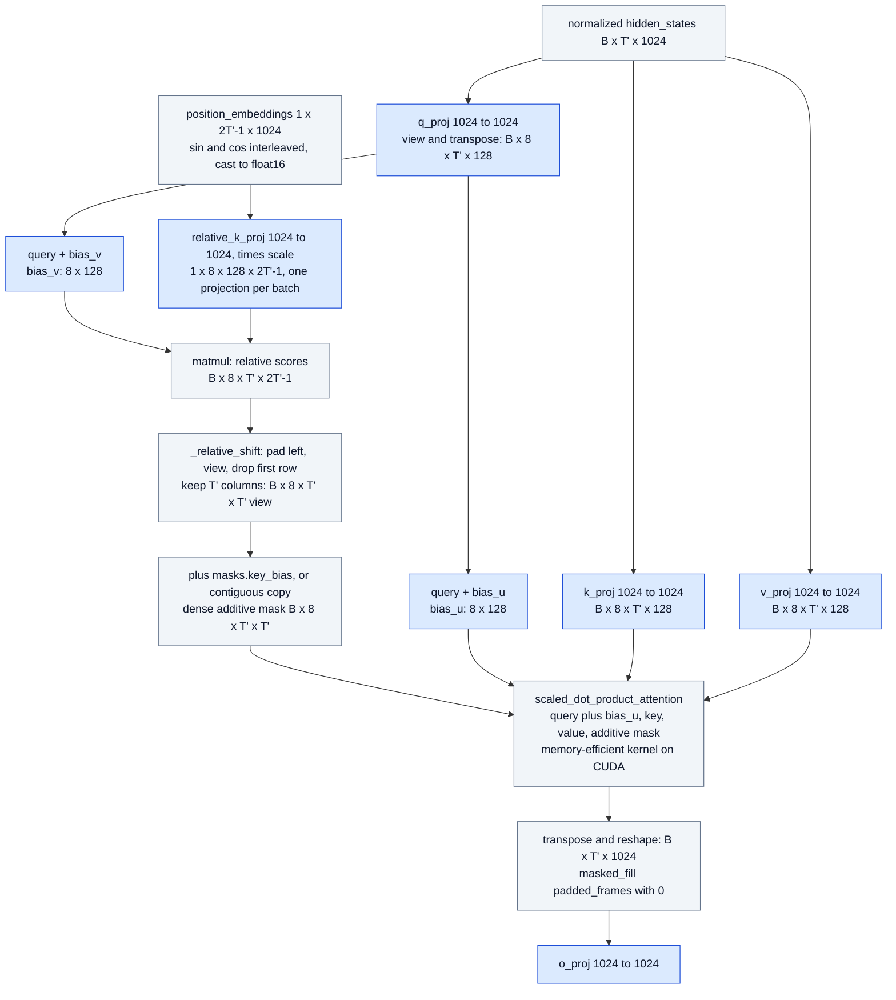
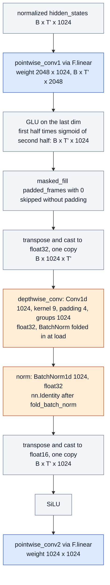
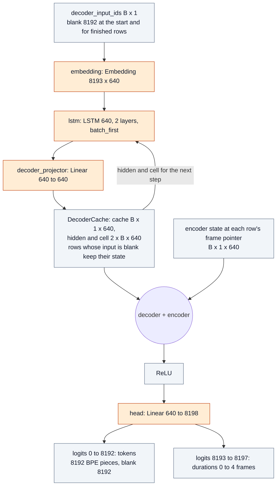
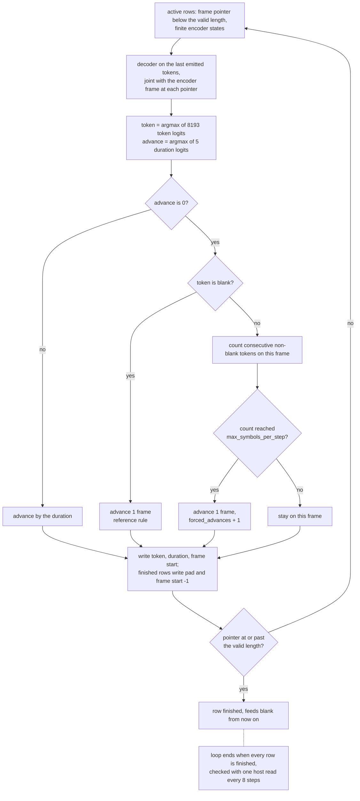

# AGENTS.md

Guidance for coding agents and contributors working on this repository. [README.md](README.md) explains how to use the runtime. This file explains how it is built, which properties must never break, and how to prove a change did not break them.

## Contents

1. [Purpose and scope](#1-purpose-and-scope)
2. [Architecture](#2-architecture)
3. [Module map and dependency rules](#3-module-map-and-dependency-rules)
4. [Invariants that must hold](#4-invariants-that-must-hold)
5. [Configuration discipline](#5-configuration-discipline)
6. [Error handling, statuses, and logging](#6-error-handling-statuses-and-logging)
7. [Coding standards](#7-coding-standards)
8. [Testing strategy](#8-testing-strategy)
9. [Verification protocol for inference changes](#9-verification-protocol-for-inference-changes)
10. [Performance work](#10-performance-work)
11. [Dependencies and environment](#11-dependencies-and-environment)
12. [Git and change management](#12-git-and-change-management)
13. [What agents may and must not modify](#13-what-agents-may-and-must-not-modify)
14. [Troubleshooting](#14-troubleshooting)
15. [Decision records](#15-decision-records)
16. [Open optimization items](#16-open-optimization-items)

## 1. Purpose and scope

This repository is a standalone PyTorch inference runtime for `nvidia/parakeet-tdt-0.6b-v3`. At runtime it uses only PyTorch, the Python standard library, and soundfile (plus FFmpeg as an optional external fallback). It must:

- produce the same tokens as the reference implementation (Hugging Face `ParakeetForTDT`);
- transcribe audio of any length with memory that does not grow with duration;
- process folders of mixed short and long files with bounded, deterministic batching;
- report every anomaly explicitly instead of producing a normal-looking transcript;
- run on a 4 GB GPU with the full weights (float16 encoder by default, float32 on request).

This repository only runs inference with the published checkpoint. Changing or replacing the model weights is out of scope.

## 2. Architecture

### Data flow of one command

```text
inference.py --transcribe <file|folder>
  commands/inference.py
    configuration/settings.py   load and validate config.toml
    runtime/logging_setup.py    open logs/log_<date>.txt, assign run id
    discover_audio_files        content-probe inputs (audio/media.inspect_media)
    commands/model_loading.py   prepare_inference_model (shared by every command):
      runtime/device.py           device, float32 matmul precision, encoder precision,
                                  float16 accumulation
      checkpoint/bootstrap.py     readiness gate, then a single strict model load
        checkpoint/orchestration.py  download + verify + convert when not ready
        checkpoint/derived.py     model.encoder-float16.pth built once from model.pth
      inference/offline.enable_graph_decoding   CUDA Graph static buffers
      inference/budget.py         allocator ceiling + calibrated batch budget
    inference/offline.py        OfflineTranscriber.transcribe
      inference/planning.py       chunks, decode streams, bounded round-robin, micro-batches
      per batch (decode runs one batch ahead: one task per decode stream
                 on decode_workers threads):
        audio/media.py            MediaSession.read_sequential_segment (decode, mono, 16 kHz;
                                  plus the recovery reach on both sides; libsndfile, or
                                  one ffmpeg process per decode stream)
        audio/features.py         log-mel features + per-recording normalization
        models/parakeet.py        ParakeetTDT.generate (float16 encoder + greedy TDT loop,
                                  each step a replayed CUDA Graph on CUDA)
      inference/recovery.py       re-decode chunks with a long non-silent wordless stretch
                                  (windows cut from memory, run between planned batches)
      inference/merging.py        word-level seam merge, then tokenizer decode and status
    CSV (folder) or terminal (single file)

python -m src.commands.benchmark --input <file|folder>
  same startup and OfflineTranscriber, warm-up + measured rounds,
  one JSON line appended to <metrics_dir>/benchmark_<date>.jsonl

python -m src.commands.worker
  same startup once, then JSON Lines requests on stdin, responses on stdout
```

### Package dependencies

Arrows point from the importing package to the imported one (see the module map in Section 3). `configuration`, `runtime`, and `text` import no other package of this repository; `audio` reaches into `inference` only for the `AudioMetadata` record of `inference/planning.py`.



### One transcription run, by thread

`OfflineTranscriber.transcribe` runs the model on the calling thread. One `batch-prefetch` thread prepares the next batch by handing each of its decode streams to the `media-decode` pool (`decode_workers` threads). Collapse re-decodes run on the calling thread between planned batches.



### Model

| Stage | Module | Shape (B = batch, T = feature frames, T' = T/8) |
|---|---|---|
| Log-mel front end | `audio/features.py` | waveform `(B, samples)` to `(B, T, 128)` plus mask `(B, T)` |
| Subsampling | `models/subsampling.py` | Conv2d stack, 3 stride-2 stages: `(B, T, 128)` to `(B, T', 1024)` |
| Positional encoding | `models/attention.py` `RelativePositionalEncoding` | `(1, 2T'-1, 1024)` sinusoidal relative positions, shared by every row and projected once per batch |
| Conformer blocks x24 | `models/conformer.py` `EncoderBlock` | half FFN, relative multi-head attention with bias_u/bias_v, conv module (pointwise convs run as linear layers on `(B, T', H)`, GLU, depthwise conv with the BatchNorm folded in at load, SiLU), half FFN, LayerNorm. Padding masks (`models/attention.py` `EncoderMasks`) are built once per batch and skipped when no row is padded after the first subsampling stage |
| Encoder projection | `ParakeetTDT.encoder_projector` | `(B, T', 1024)` to `(B, T', 640)` |
| Prediction network | `models/decoder.py` | embedding + 2-layer LSTM + projection, blank-aware cache |
| Joint | `models/joint.py` | ReLU(enc + dec), then linear to 8193 token logits + 5 duration logits |
| Greedy TDT loop | `ParakeetTDT._decode_eager`, or `models/graphed_decoding.py` on CUDA | per step: argmax token, argmax duration, advance frame pointer |

Precision (`ParakeetTDT.set_encoder_dtype`): with `encoder_precision = "float16"` on CUDA, the encoder and encoder projector run in float16; the decoder, joint, the relative positional frequencies (`inv_freq`), every depthwise convolution, and the BatchNorm after it stay float32. `encode()` casts features to the encoder dtype and returns float32 states to the loop. With `float16_accumulation` (`runtime/device.py` `apply_float16_accumulation`) cuBLAS also adds the float16 products in float16; the setting is process-wide and is set explicitly either way.

Greedy TDT rules (`generate`):

- A blank token with duration 0 advances one frame. This is the reference rule.
- A non-blank token updates the decoder state. Its duration may be 0, in which case the decoder stays on the same frame.
- After `max_symbols_per_step` consecutive non-blank zero-duration tokens on one frame, the last one is forced to advance one frame. It is counted in `GenerationResult.forced_advances`. This is the NeMo-style guard; see D3 in [Decision records](#15-decision-records).
- Rows whose encoder output is non-finite are marked finished before decoding and emit no tokens.
- `maximum_steps = max_symbols_per_step * encoder_length` is a safety net that the guard makes unreachable.

### Model diagrams

Node labels give the checkpoint attribute name (the state-dict key below the prefix in the subgraph title), the layer, and the output shape. Colors show the precision with the default `encoder_precision = "float16"` on CUDA: blue is float16, orange float32, grey has no weights. Parameter counts are from the loaded checkpoint (627.0 M in total).

#### ParakeetTDT (`models/parakeet.py`)



#### Subsampling (`encoder.subsampling`, `models/subsampling.py`)



Time lengths follow `(length + 2 - 3) // 2 + 1` per strided convolution, which is `ceil(length / 2)`: a full 1500-frame chunk gives T' = 188.

#### EncoderBlock (`encoder.layers.N`, `models/conformer.py`)



#### FeedForward (`feed_forward1`, `feed_forward2`)



#### Attention (`self_attn`, `models/attention.py`)

Eight heads, D = 128, scale `1 / sqrt(128)`; `num_key_value_heads` equals the head count, so `repeat_key_value` is a no-op for this checkpoint. Projections have no bias (`attention_bias = false`).



#### ConvolutionModule (`conv`, `models/conformer.py`)

Checkpoint weights stay Conv1d shaped (`2048 x 1024 x 1`, `1024 x 1 x 9`, `1024 x 1024 x 1`); `convolution_bias = false`, so the depthwise bias exists only after the fold.



#### Decoder and JointNetwork (`decoder`, `joint`, `models/decoder.py`, `models/joint.py`)



#### Greedy TDT step (`ParakeetTDT._decode_eager`, `GraphedGreedyDecoder._step`)



## 3. Module map and dependency rules

| Package | Responsibility | May import |
|---|---|---|
| `configuration/config.py` | Load and validate checkpoint JSON (`config.json`, processor, generation) | standard library only |
| `configuration/settings.py` | Load and validate `config.toml` | standard library, `config.py` |
| `runtime/` | Device selection and report, precision policy, dated run logging, atomic writes, peak process memory, GPU memory measurement and allocator cap | standard library, torch |
| `text/` | Tokenizer decoding from `tokenizer.json` | standard library, torch |
| `models/` | Network modules, the eager TDT loop and its CUDA Graph form (`graphed_decoding.py`), strict checkpoint loading | torch, `configuration`, `runtime.device` |
| `audio/features.py` | Feature extraction | torch, `configuration` |
| `audio/resampling.py` | Windowed-sinc resampling on a global grid | torch |
| `audio/media.py` | Probe and decode media, sequential chunk reading, persistent FFmpeg stream | torch, soundfile, subprocess, threading, `audio/resampling.py`, `inference.planning` (for `AudioMetadata`) |
| `inference/planning.py` | Pure planning math: chunks, schedule, batches | standard library only |
| `inference/merging.py` | Word grouping and seam alignment | standard library only |
| `inference/recovery.py` | Gap detection and recovery windows | standard library only |
| `inference/offline.py` | Orchestration, parallel decode streams (`_StreamDecoder`), inline collapse recovery, merge, statuses, `enable_graph_decoding` | everything above except `commands` and `checkpoint` |
| `inference/budget.py` | Allocator ceiling and calibrated batch budget | `audio.features`, `configuration`, `models`, `runtime.memory` |
| `checkpoint/` | Download, verify, convert, readiness marker, derived float16 encoder file | standard library, torch, `configuration.settings`, `runtime` |
| `commands/` | CLI parsing, terminal output, wiring; shared startup in `model_loading.py`; the benchmark and worker commands | anything |

Rules:

- `models/` never imports `audio/`, `inference/`, `checkpoint/`, or `commands/`.
- `checkpoint/` does not import the model. `bootstrap.py` receives a `loader` and `derived.py` a function that builds the state dict, so the checkpoint layer stays independent of the architecture.
- Terminal printing happens only in `commands/`. Library code logs through `logging.getLogger(__name__)` and never prints.
- Command modules use literal logger names (`"src.commands.inference"`), not `__name__`. Under `python -m`, `__name__` is `"__main__"`, which falls outside the `"src"` logger that owns the log file.
- New public names go into the package `__init__.py` and its `__all__`.

## 4. Invariants that must hold

A change that breaks any of these is a regression, whatever else it improves.

### Model and checkpoint

1. **State-dict names are fixed.** The top-level attributes `encoder`, `encoder_projector`, `decoder`, `joint` and every nested attribute name mirror checkpoint keys. Renaming one breaks strict loading. File and class names may change; attribute names may not.
2. **Loading is strict.** `load_state_dict(strict=True, assign=True)`. Missing or unexpected keys raise.
3. **Loading is safe.** `torch.load(..., weights_only=True)` everywhere. Never switch to `weights_only=False`. Checkpoints are memory-mapped only when the model moves to an accelerator; a CPU model would otherwise keep the file mapped (and, on Windows, locked against replacement) for the whole process.
4. **Meta-device construction.** `load_model` builds the model under `torch.device("meta")` to skip random initialization. Any new non-persistent buffer must be created with an explicit `device="cpu"` in its constructor, as `inv_freq` and `duration_values` are. `_require_materialized` fails loudly otherwise.
5. **Pinned artifacts.** URLs, sizes, SHA-256, and Git blob SHA-1 values in `checkpoint/download.py` identify the verified upstream revision. They are an integrity invariant, not configuration. Update them only together with a full parity re-verification.
6. **Unimplemented config values are rejected.** `validate_config` requires `hidden_act == "relu"` (joint), `encoder_config.hidden_act == "silu"`, and `scale_input == false`, because the modules hard-wire that math. Add support in the modules before relaxing a check.
6a. **Derived checkpoints follow `model.pth`.** `model.encoder-float16.pth` is valid only while its manifest (written last) records the current `model.pth` size, modification time in nanoseconds, and the schema version; size alone is not enough, because a different checkpoint of the same architecture has the same size. Converting `model.pth` deletes every derived file (`remove_derived_checkpoints`). The derived file keeps `model.pth`'s own metadata. A checkpoint whose encoder is already narrower than requested is refused, never widened. An unwritable weights directory falls back to casting in memory with a warning; the temporary file is created before the build so that is detected before any weights are loaded. The checkpoint file name comes from `configuration.config.CHECKPOINT_FILENAME` only.

6b. **BatchNorm folding is for inference only.** `load_model` folds every convolution BatchNorm into its depthwise convolution by default (`fold_batch_norm=True`): `norm` becomes the identity and the state dict no longer matches the checkpoint. Anything that saves or compares a state dict against a checkpoint layout passes `fold_batch_norm=False`; the derived float16 file builder does. Derived files are schema 3, which keeps the BatchNorm in float32 so the fold is exact.

### Numerics and parity

7. **Feature extraction matches the reference.** Constants: preemphasis 0.97, periodic-false Hann window of 400 samples, `n_fft` 512, hop 160, constant STFT padding, Slaney mel filters, `LOG_GUARD = 2**-24`, `NORMALIZATION_EPSILON = 1e-5`. Normalization is per recording with divisor n for the mean and n - 1 for the variance. Both divisors are clamped to at least 1; that changes nothing for n >= 2 and keeps inputs with 0 or 1 valid frames finite.
8. **Parity targets.** With a float32 encoder: same tokens and durations single-file vs mixed-batch, and same content tokens and text as HF `ParakeetForTDT`. With the float16 encoder: the same transcript text single-file vs mixed-batch (a blank or duration may move by a frame), and word error rate on labeled long-form audio within noise of float32. CUDA Graph decoding must be bit-identical to the eager loop. Long-form transcripts byte-identical to the previous commit, unless a change intends to alter them, in which case say so and measure it.
8a. **Depthwise convolutions stay float32.** cuDNN 9.24's float16 depthwise Conv1d (groups 1024, kernel 9) returned garbage for some inputs in batches of 7 or more rows, which emptied whole chunks. `ConvolutionModule.forward` casts around the depthwise convolution in its weight dtype (each cast is the same copy as the layout change); never cast those weights to float16.
8b. **Mask fast path is exact.** `Subsampling.leaves_padding` decides from the shortest row whether any time mask changes a value; when none does, the subsampling masks and `EncoderMasks` are skipped and the outputs are bit-identical. The padding key bias is half the dtype's lowest value, so adding a score never overflows to -inf and an all-padding row stays finite.

### Planning, decoding, merging

9. **Chunk budget.** Every work item satisfies `feature_frames = source_samples // 160 + 1 <= max_chunk_feature_frames`. The core is at most `(max_chunk - 2 * overlap) * 160 - 1` samples, and the one-sample reserve prevents the 1500 vs 1501 off-by-one.
10. **Batch budget is padded.** `len(batch) * max(item.feature_frames) <= max_batch_feature_frames`. Do not revert to summing unpadded frames. The value used is the configured one lowered (never raised) by `inference/budget.py`.
11. **Cores tile the file.** Cores are contiguous, non-overlapping, and cover `[0, total_samples)`. Sources are the core plus at most `overlap` on each side, clamped at 0 and at the end of the file.
12. **Sequential decoding.** Chunks of one file are read in order through `read_sequential_segment`. Only `previous_end - current_start` samples are reused, and never through `tensor[-k:]` with `k == 0`, which selects the whole tensor. A non-positive overlap decodes fresh. The result must match a fresh decode of the same interval: bit-identical at the native 16 kHz, and within 1e-6 after resampling (float32 summation order; a real grid mismatch shows up as differences of order 1e-2).
    - **FFmpeg path.** Formats libsndfile cannot read are decoded by one `ffmpeg` process per decoder session (`_FfmpegStream`), which resamples continuously from where it started. Chunks read in order must equal the same slices of one continuous decode. A jump forward longer than the piece to read (the decoder's next block) restarts `ffmpeg` at the new position with `-ss`; a request behind the stream position uses a one-off decode of that range. The process is closed with its session, and a non-zero exit raises instead of passing as a short read.
12a. **Resampling on a global grid** (`audio/resampling.py`). Windowed-sinc (Hann, 6 zero crossings, 0.99 roll-off) polyphase resampling. Every source block starts on a multiple of the reduced source period, so any target interval equals the same slice of the whole file resampled in one piece. Never resample a piece independently from its own start, because for ratios like 44.1 kHz to 16 kHz that shifts the grid at every seam.
13. **Decode streams and session lifetime.** The planner gives every chunk a `stream_index` (`planning._decode_streams`): a long file's chunks are dealt to up to `decode_workers` streams in blocks of `ceil(rows_per_batch / decode_workers)` consecutive chunks, fewer streams per file when several long files are in progress. One `_StreamDecoder` per stream opens its session at the stream's first chunk and closes it after its last; never open all files up front. It reuses the overlap only when it also read the previous chunk, and seeks forward otherwise. At most `max_open_files` multi-chunk files are in rotation at once (`_schedule_round_robin`); single-chunk files are never held back. A batch gives each stream one task on the `media-decode` pool, the next batch is decoded only after the current one finished, so a stream is never used by two threads at once. Decoders are closed after both thread pools have shut down.
14. **Word-level ownership** (`inference/merging.py`). Tokens are grouped into words (a word starts at a piece beginning with the SentencePiece marker), and a word is never split between chunks. In the overlap, the longest run of words both chunks agree on is found: same letters and digits, start times within `merge_tolerance_feature_frames`. Each agreed word is taken once, from the chunk whose core holds its start. Without agreement, whole words go to the chunk whose core holds their start. Neighboring chunks disagree on word times by up to about 0.5 s, so never go back to token-level or midpoint ownership.
    - **Collapse recovery** (`inference/recovery.py`, `OfflineTranscriber._start_recovery`, `_run_recovery_batch`). A chunk whose core has a stretch longer than `untranscribed_gap_seconds` with no word start and RMS at least `gap_silence_rms` is re-decoded. The window start is shifted by each configured offset. Offsets are at most the overlap, so the core is always covered and the budget kept. The first window, in configured order, without the gap wins. Otherwise the smallest gap is kept and the file is `untranscribed_gap`. Every chunk is decoded with the largest offset's reach of extra audio on each side (the span), so windows are sliced from memory (`slice_segment`) and recovery never reads the file. Windows are tried in order, one per chunk per batch, or several when fewer chunks than rows are waiting; the choice is the same as trying all of them. Recovery batches are bounded like planned batches and run between planned batches whenever a full batch is waiting, the rest after the last one. Only waiting chunks keep their span.
15. **No text rewriting.** No deduplication of repeated words, no dictionary, word list, phrase, or name correction.

### Resource policy

16. **Memory does not scale with duration.** Never hold a full-file waveform, feature tensor, encoder output, or logits for long audio.
17. **OOM policy.** The batch budget is fitted to free memory before the first batch, and the allocator is capped at physically free memory so Windows cannot spill into system memory. If an OOM still happens, stop with a diagnostic. No retry, no silent batch reduction during a run, no CPU fallback, no partial CSV. `memory.reserve_mib` is preferred headroom: when keeping it leaves no room for one chunk, the run uses the physical memory and prints a warning; it fails before the first batch only when one chunk does not physically fit.
18. **Device agnostic.** Device resolution happens once in `runtime/device.select_device()`. Components use the model's device. Do not assume CUDA.

## 5. Configuration discipline

- Every user-facing value lives in `config.toml` and is parsed in `configuration/settings.py`. That covers paths, log level, network policy, budgets, and reporting interval.
- Every key is required. Validation reports `section.key` and the rule it broke. There are no silent defaults.
- Cross-field rules enforced today:
  - `max_chunk_feature_frames > 2 * overlap_feature_frames`
  - `max_batch_feature_frames >= max_chunk_feature_frames`
  - `0 <= max_padding_fraction <= 1`
  - `request_timeout_seconds > 0`
  - `download_attempts >= 1`
  - `untranscribed_gap_seconds > 0`
  - every `recovery_start_offsets_feature_frames` entry is non-zero and at most `overlap_feature_frames` in size
  - `warmup_rounds >= 0`, `measured_rounds >= 1`, `git_timeout_seconds > 0`
  - `max_open_files >= 1`, `decode_workers >= 1`, `reserve_mib >= 0`
  - `encoder_precision` in `("float32", "float16")`, `float32_matmul_precision` in `("highest", "high")`
- Constants that belong to the checkpoint's input contract (feature constants, pinned hashes) stay in code with a comment explaining why they are not settings.
- Adding a setting means:
  1. add a field to the dataclass;
  2. add the parser and its validation;
  3. add the key to `config.toml` with a comment;
  4. add a test in `tests/unit/test_runtime_services.py`;
  5. add a row to the README configuration table.

## 6. Error handling, statuses, and logging

### File statuses

`inference/offline.py` `FileStatus`, most severe first:

| Status | Assigned when |
|---|---|
| `numerical_failure` | features or encoder states non-finite for any chunk; that chunk's tokens are dropped |
| `input_nonfinite` | decoded samples contained NaN/Inf (zeroed before inference) |
| `decoder_forced_advance` | the per-frame guard fired |
| `untranscribed_gap` | transcript not empty, but a chunk still has a long non-silent stretch without words after collapse recovery |
| `no_speech` | transcript empty and every chunk is digital silence |
| `empty_transcript` | transcript empty and audio not silent |
| `unreadable` | assigned by `commands/inference.py` for files discovery could not read |
| `ok` | none of the above |

Statuses are derived from objective facts only. Do not add heuristics that judge transcript quality. A repeated-token "gibberish" rule was removed because it flagged natural speech (D5).

### Error classes

| Situation | Behavior |
|---|---|
| One file is not decodable audio | `ValueError`; the file becomes an `unreadable` row and the run continues. |
| `ffprobe`/`ffmpeg` not installed | `CodecUnavailableError`; per-file `unreadable`. |
| `FFMPEG_BINARY`/`FFPROBE_BINARY` set to a missing path | `RuntimeError`; the run stops (setup error). |
| OS cannot open the file (missing, permission, too many open files) | `OSError` surfaces. It is never treated as an unsupported format. |
| Invalid settings or checkpoint JSON | `ValueError` before model allocation. |
| Not even one full chunk fits in the free GPU memory | `RuntimeError` at startup, before any batch, naming the memory needed and free. |
| Accelerator OOM | `RuntimeError` naming the batch items, frames, memory, and the keys to change. |
| CUDA Graph decoding cannot take a batch (larger than its static buffers) | The eager loop decodes that batch; same output. |
| A worker request fails (not UTF-8, not a JSON object with a string `path`, missing path, OOM) | `{"event": "error"}` on stdout with the traceback in the log; the worker keeps serving. Requests whose files are all unreadable are not failures: each file gets an `unreadable` event, then `done`. |
| The float16 file cannot be written (read-only weights directory) | A warning on the terminal and in the log; the encoder is cast in memory. |
| CSV write fails | Fallback to `logs/transcriptions_<run id>.csv`; exit code 1. |

Never swallow an exception without logging it. Never report success for work that did not happen.

### Logging

- `logs/log_<YYYY-MM-DD>.txt` in `paths.log_dir`, appended. Each line carries `run=<id>`.
- INFO: run start, input, checkpoint action, device report, encoder precision, CUDA Graph decoding, load time, memory ceiling and budget, plan summary, recovered chunks, one line per file (status, duration, chunks, words, `processing_seconds`, `real_time_factor`). Per-file processing time is attributed: the file's own decode time plus a feature-frame share of each batch it was in, plus collapse re-decodes.
- WARNING: non-`ok` files, unreadable files, stale readiness marker, rejected legacy checkpoint.
- DEBUG: one line per batch with its items, frames, and stage timings.
- Never log secrets or full transcripts.

## 7. Coding standards

- **Readability over brevity.**
  - One transformation per statement, with descriptive intermediate names.
  - Multi-line signatures and calls when they are dense.
  - Shape comments such as `# (B, T, H)` on tensor transitions that are not obvious. Shape comments must be true.
- **Comments explain why:** a constraint, a trade-off, or an external quirk. Never restate the code. No emojis or decorative characters in code, comments, or terminal output.
- **Docstrings:** on public functions and classes, and on non-trivial internals. Cover purpose, arguments, returns, shapes, raised errors, and side effects.
- **Hot loop cost:** in `ParakeetTDT.generate`, every elementwise op runs once per emitted symbol. Count kernel launches before adding ops there, and measure (see [Performance work](#10-performance-work)).
- **No dead code:** no unused imports, no placeholder logic. Remove what your change makes unused.
- **Terminal output:** plain text only, for example `Batch: 12 / 241, Progress: 4.98 percent`.
- **Surgical changes:** keep diffs focused. Do not reformat or refactor unrelated code in the same change.

## 8. Testing strategy

The suite uses pytest (`requirements-dev.txt`, configured by `pytest.ini`). Tiers are assigned by directory in `tests/conftest.py`, so a test cannot sit in the wrong tier:

```powershell
venv\Scripts\python.exe -m pytest                     # all tiers
venv\Scripts\python.exe -m pytest -m "not full"       # fast suite: no checkpoint, no GPU
venv\Scripts\python.exe -m pytest -m full             # real checkpoint and real speech
venv\Scripts\python.exe -m pytest -m regression       # only the fixed-defect guards
```

| Tier | Location | Needs | Contents |
|---|---|---|---|
| unit | `tests/unit/` | nothing | `test_planning.py` (frame estimate, tiling and batch properties), `test_model.py` (config validation, features, TDT loop, duration table, non-finite rows, strict loading, tokenizer, attention), `test_offline.py` (sequential decoding bit-identity, downmix, ffprobe metadata, merge, statuses), `test_merging.py` (word grouping, seam alignment, fallback ownership), `test_recovery.py` (gap detection, recovery windows, collapse recovery wiring), `test_resampling.py` (pass band, alias rejection, interval equals whole file), `test_ffmpeg_stream.py` (persistent stream equals one continuous decode, one process per file, reads behind the stream, process closed; skipped without FFmpeg), `test_benchmark.py` (peak process memory, summary statistics, rounds without audio, warm-up and measured rounds appended as one JSON line), `test_memory_budget.py` (row arithmetic, ceiling and headroom, cache release, report), `test_graphed_decoding.py` (the static-buffer step against the eager loop on CPU, guard, duration table, non-finite rows, oversized batches), `test_derived_checkpoint.py` (float16 file built once, rebuilt when stale or damaged, same weights as casting, no widening), `test_worker.py` (protocol, folders, bad requests), `test_scoring.py` (numpy word errors against the textbook recurrence, reference files), `test_checkpoint.py` (download reuse, retry, pin rejection, conversion, against a real local HTTP server), `test_bootstrap.py`, `test_cli.py`, `test_runtime_services.py` |
| regression | `tests/regression/test_fixed_defects.py` | nothing | one test per fixed defect; each docstring states the original failure and each section names the fixing commit |
| full | `tests/full/` | prepared checkpoint | uses the configured precision and graph decoding. `test_accuracy.py` (exact transcripts, corpus WER budget, batching parity, determinism), `test_long_form.py` (chunking at scale, WER budget, CUDA memory bound past one full batch, no empty chunks in full batches, optional user recordings), `test_anomalies.py` (silence, noise, NaN samples, 48 kHz stereo), `test_command.py` (the real `inference.py` in a subprocess, folder CSV, FFmpeg fallback, error exit), `test_worker_process.py` (the real worker serving several requests), `test_graph_decoding_gpu.py` (captured graph bit-identical to the eager loop), `test_memory_budget_gpu.py` (the chosen budget runs under the ceiling), `test_reference_parity.py` (HF `ParakeetForTDT` on CPU, skipped without `transformers`), `test_reference_long_form.py` (opt-in labeled recordings: `PARAKEET_TEST_REFERENCE_DIR`, `PARAKEET_TEST_REFERENCE_MAX_WER`) |

Shared helpers live in `tests/support.py`:
- the tiny checkpoint writer;
- the WAV writer;
- settings factories;
- `ScriptedModel`, a stand-in for the model's `generate`;
- the speech-clip loader, which checks each file's SHA-256 against `manifest.json`;
- a WER computed one numpy row at a time (hour-long transcripts in seconds) and the reference transcript reader.

Fixtures live in `tests/conftest.py`: `tiny_checkpoint_dir`, `tiny_configuration`, and the session-scoped `real_settings`, `real_model`, `speech_clips`.

### Real speech data

`tests/data/librispeech/` holds five LibriSpeech dev-clean clips (CC BY 4.0, attribution in `SOURCE.md`) and `manifest.json`. For each clip the manifest records:

- the SHA-256;
- the LibriSpeech reference text;
- `expected_transcript`, this runtime's output, recorded and cross-checked against Hugging Face;
- `full_context_transcript`, Hugging Face on the unchunked clip.

If a deliberate change alters a transcript, update `expected_transcript` in the same commit and state why in the commit body. Never regenerate expectations to make an unexplained diff disappear.

### Known-defect tests

pytest runs with `xfail_strict = true`. When a known defect is tracked by an `xfail` test, fixing the defect makes the test pass unexpectedly and fail the run. Remove the marker in the same change that fixes the defect. There are no known-defect tests at the moment. The chunk-boundary tests were converted to budgets when word-level merging landed.

### Thresholds

The WER budgets are measured values plus a small margin, with the measurement written next to each constant. WER normalization spells out titles ("Mr" becomes "mister"), because LibriSpeech references spell them out.

- corpus (clip by clip) 3.67% measured, budget 4.6%;
- chunked clip against the unchunked reference 1.49% measured, budget 3%;
- long form (196 s, 15 chunks) 4.59% measured, budget 5.5%;
- cost of chunking over clip by clip: at most 1.5 points;
- opt-in labeled long-form set (the two podcasts in the local `docs/` folder): corpus 6.66% float16 with float16 accumulation (6.67% without), 6.63% float32; budget 7.0%; recovered chunks at most 10% (measured 2.9%).

Tighten a budget when accuracy improves. Never loosen one without a written reason.

### Rules

- Every bug fix gets a regression test in `tests/regression/` that fails on the old code. Name the defect and the fixing commit.
- Prefer the tiny fixture checkpoint so tests run without the 2.5 GB weights or a GPU. Use `full` only for what needs real weights or real speech.
- Prefer randomized or property-style checks for planner math, with fixed seeds.
- The `full` tier never downloads the checkpoint. It skips with an explanation when `.ready` is missing.
- Update existing tests when behavior changes on purpose. Do not delete or weaken them to make a change pass.
- Do not claim tests pass unless they were run in this environment.

## 9. Verification protocol for inference changes

Unit tests cannot prove numerical parity with the full model. Any change under `audio/`, `models/`, `inference/`, or `text/` must pass `pytest -m full`, which automates checks 1 and 2 (and part of 3 and 6) on the committed clips. The remaining checks need longer recordings and instrumentation. Run them with the real checkpoint on the development GPU before merge.

1. **Token parity, single vs mixed.** Transcribe each sample WAV alone, then all together as one folder. Compare token IDs and durations after stripping trailing padding (`pad_token_id` with duration 0), because rows in a batch are right-padded to the longest row. They must be identical.
2. **Parity with the reference.** For each sample WAV, run Hugging Face `transformers` `ParakeetForTDT.from_pretrained(weights_dir)` with its `AutoProcessor` and `model.generate(..., return_dict_in_generate=True)`. Compare content tokens (blank and pad removed) and decoded text with this runtime. `transformers` is only a verification tool here; it must never become a runtime import.
3. **Long-form regression.** Transcribe long recordings (tens of minutes) with the previous commit and the new one. Transcripts must be byte-identical unless the change intends otherwise. With labeled recordings, run `test_reference_long_form.py` and report the word error rate before and after.
4. **Budget and session instrumentation.** Wrap the feature extractor and `MediaSession` for a mixed run. Check that:
   - the tensor frames per batch equal the planned maximum;
   - no chunk is over `max_chunk_feature_frames`;
   - no padded batch is over `max_batch_feature_frames`;
   - there is one session per file;
   - decoded source frames equal container frames (no re-decoded overlap).
5. **Memory bound.** Record peak CUDA allocation and working-set growth for two recordings of very different length. They must be the same.
6. **Anomaly behavior.** Check that:
   - silence gives `no_speech`;
   - noise gives `empty_transcript`;
   - NaN samples give `input_nonfinite`;
   - a forced stuck joint gives `decoder_forced_advance` without raising;
   - a simulated OOM stops once with no CSV;
   - an M4A through FFmpeg gives the same text as its WAV source.

Keep verification scripts outside the repository (a scratch directory). Report the actual numbers in the pull request.

## 10. Performance work

- **Measure first.** On the 112.6-minute `docs/` folder with the defaults: wall 11.92 s (benchmark command, 3 rounds); generation 10.1 s (mostly the encoder); media decoding about 6.5 s of batch time on four threads, hidden behind the GPU; collapse recovery about 0.7 s. The 74-minute MP3 alone: 7.9 s, of which 6.5 s is the model. Before this round of work: 19.06 s and 12.5 s; earlier float32 settings took 97.4 s for the folder.
- **Encoder kernels** (float16, 16 full chunks, 269 ms with the defaults, 372 ms before D26 and D27): cuBLAS GEMMs about 58%, layout copies and casts about 10%, SiLU 6%, residual and bias adds about 8%, memory-efficient attention 4%, depthwise convolution 4%, LayerNorm 3%. A further step needs fused custom kernels (nvcc and MSVC build tools are present on the development machine; Triton is not), estimated at about 1 s on the 74-minute file.
- **Encoder:** compute-bound, linear in rows. Per 15 s row on the RTX 3050 Ti Laptop: about 68 ms float32, 47 ms TF32, 24 ms float16. At 8 rows in float32, feed-forward is 50%, attention 30% (relative-position projection 6% before it was shared per batch), convolution 11%, subsampling 6%. `cudnn.benchmark` made no difference.
- **Decoding loop:** about 46 kernel launches per step; eager 1.2 to 2.0 ms per step against 0.40 ms of GPU work. A replayed CUDA Graph takes 0.38 to 0.41 ms per step at 1 to 8 rows, so one graph sized for the largest batch serves all. cuDNN's LSTM step costs about 0.30 ms; a hand-written fused LSTM cell was slower (0.98 ms) and was dropped.
- **Batch size and speed** (float32, little VRAM used by other programs): per chunk, 1 row 176 ms, 2 rows 140 ms, 4 rows 100 ms, 8 rows 86 ms. An earlier measurement that ranked 4 rows fastest was taken with about 870 MiB of VRAM used by other programs and was most likely distorted by the Windows sysmem fallback.
- **Benchmark command.** `python -m src.commands.benchmark --input <path>` loads once, warms up, runs the measured rounds, and appends one JSON record with the commit, settings, per-round stage timings, per-file metrics, memory peaks, and whether the transcripts stayed identical. Use it for A/B comparisons.
- **A/B protocol.**
  1. Check out the baseline in a separate `git worktree`.
  2. Point it at the same checkpoint (a directory junction or symlink; never copy or move the weights). Remove the junction with `rmdir` before removing the worktree, never by deleting through it.
  3. Run both versions on the same input for at least three rounds, alternating which one runs first.
  4. Compare wall and generation seconds (mean and spread) and the transcripts.

  Laptop GPUs drift several percent with temperature, so a difference smaller than the spread between rounds is noise.
- **Output must not change.** Every performance change must keep token parity. Faster but different output is a behavior change and must be justified and measured as one.
- **Windows:** `torch.compile` must not be used on Windows.
- **Memory is the binding constraint on 4 GB GPUs.** A full 15 s chunk needs about 110 MiB in float32 and 55 MiB in float16 on top of the weights. The automatic budget measures this at startup.
- **Windows sysmem fallback.** Under WDDM the NVIDIA driver can back allocations that do not fit in VRAM with shared system memory instead of raising OOM. The allocator cap prevents it for this process; when benchmarking, still check the peak allocation against free VRAM, not just the timing.
- **MP3 seeking** in libsndfile costs about 9 ms per minute of position in a fresh session (0.6 s at minute 70). Avoid re-opening sessions for random access; read in order or reuse one session.

## 11. Dependencies and environment

- Runtime dependencies: PyTorch, soundfile (brings NumPy), the standard library. FFmpeg is optional and external.
- Do not add torchaudio, torchcodec, librosa, NeMo, or Transformers as runtime dependencies. Do not hardcode an FFmpeg path; resolve it through `FFMPEG_BINARY`/`FFPROBE_BINARY` or `PATH`.
- Install with `pip ... --no-cache-dir`. Do not pin versions (`==`, `>=`, `<=`, `~=`) in install commands or dependency files.
- Never upgrade, downgrade, or reinstall PyTorch as a side effect of another install. If a package would change torch, stop and ask.
- Runtime dependencies are listed in `requirements.txt`, and test dependencies (pytest) in `requirements-dev.txt`. Both are unpinned. PyTorch is installed separately per platform.
- Use the repository's `venv` interpreter.

## 12. Git and change management

- **`main`** is the stable branch. It is protected by a ruleset: no deletion, no force push, changes only through pull requests.
- **Branch names** use a prefix that says what the work is:
  - `feature/` for new capability;
  - `fix/` for defects (several small related fixes may share one branch);
  - `perf/` for measured performance work;
  - `experiment/` for exploratory work that may never merge;
  - `research/` for research-specific pipelines.

  Avoid vague names such as `latest`, `new`, or `final`.
- **Commits** follow Conventional Commits (`feat`, `fix`, `perf`, `refactor`, `test`, `docs`). Each commit is one logical change with a body that explains why, what changed, and how it was verified. Do not write one-line commits for non-trivial changes.
- **Pull requests** contain: a summary, the motivation, the behavior changes, the tests run, and the verification numbers (Section 9). For performance work, add before/after timings. Also list known limitations.
- **Tags** mark milestones after merge to `main`, only when tests and verification passed.
- **Never commit** weights (`*.safetensors`, `*.pth`), `venv/`, `logs/`, `docs/` sample audio, datasets, credentials, or generated CSVs. `.gitignore` covers these; check `git status` before committing.

## 13. What agents may and must not modify

May, with tests:

- planning, scheduling, decoding orchestration, and merge logic, keeping every invariant in Section 4;
- performance of the TDT loop, feature extraction, and media decoding, with A/B evidence and parity;
- settings, adding validated keys;
- statuses, adding objective ones;
- documentation, kept consistent with the code.

Must not, without an explicit request from the maintainer:

- change the model architecture's math, activation choices, or state-dict attribute names;
- modify the downloaded weights or the pinned hashes;
- switch `torch.load` to `weights_only=False`;
- add text post-processing (dedup, dictionaries, corrections);
- add runtime dependencies listed as forbidden in Section 11, or pin versions;
- add CLI flags (the public contract is `--transcribe <path>` for `inference.py`, `--input <path>` for the benchmark, and the JSON Lines protocol of the worker; tunables go in `config.toml`);
- push to `main`, force-push, delete branches, or change repository settings;
- create or overwrite README.md or AGENTS.md unasked.

## 14. Troubleshooting

| Message (excerpt) | Cause | Fix |
|---|---|---|
| `Out of memory during model generation for batch items [...]` | Another program took GPU memory after startup, or the headroom was too small. | Raise `memory.reserve_mib` or lower `inference.max_batch_feature_frames`. Close other GPU processes. |
| `One full chunk needs about N MiB but only M MiB of GPU memory is free` | The weights loaded, but no chunk fits beside them. | Close other GPU programs, or lower `inference.max_chunk_feature_frames`, or set `encoder_precision = "float16"`. |
| `Warning: less than memory.reserve_mib of GPU memory was free` | Little free VRAM at startup; the run uses all of it. | Nothing, unless other GPU programs start later; then close them or expect an out-of-memory stop. |
| `The checkpoint stores a torch.float16 encoder and cannot be loaded as torch.float32` | A float16 file was passed for a float32 run. | Load `model.pth` for float32 (the commands do this). |
| `Warning: cannot write model.encoder-float16.pth in ... ; casting model.pth to float16 in memory instead` | The weights directory is read-only. | Nothing; or make the directory writable once so the file can be built. |
| `ffprobe was not found in PATH. Set FFPROBE_BINARY externally.` (in an `unreadable` reason) | FFmpeg not installed, and the file is not a libsndfile format. | Install FFmpeg or set `FFPROBE_BINARY`/`FFMPEG_BINARY`. |
| `FFPROBE_BINARY points to a missing executable` | The environment variable is set to a wrong path. | Fix or unset the variable. |
| `Input path does not exist` | Typo in `--transcribe`. | Check the path; nothing was loaded. |
| `No readable audio files found under ...` | The folder has no decodable audio, or the extension filter excludes everything. | Check `inference.audio_extensions` and the files. |
| `readiness marker is stale (model.pth missing or resized); re-preparing` (log) | `model.pth` changed since the marker was written. | None; preparation runs automatically. |
| `Downloaded content identity mismatch for <file>` | Download corrupted, or the upstream file changed. | Retry. If it persists, upstream changed and the pins need a deliberate update plus re-verification. |
| `Remote size changed for <file>` | Upstream artifact differs from the pinned size. | Same as above. |
| `Strict state-dict load reported incompatibility` | The checkpoint does not match the architecture. | Delete `weights_dir/.ready` and `model.pth`, then rerun to reconvert. |
| `Tensors were not materialized from the checkpoint` | A new non-persistent buffer was not created on CPU. | Create it with `device="cpu"` in the module constructor (Invariant 4). |
| `inference.<key> must be ...` | Invalid `config.toml` value. | Fix the named key. |
| `FFmpeg failed while decoding <file> (exit N): ...` (in the log) | ffmpeg could not decode part of the stream; the message ends with ffmpeg's own error lines. | Check the file with `ffmpeg -i`. |
| A run is several times slower than usual, with no error | On Windows, VRAM was overcommitted and the driver moved allocations to shared system memory (possible only with `memory.cap_to_free_memory = false`, or caused by another program). | Keep `cap_to_free_memory` on, close other GPU processes, and compare `Peak accelerator memory allocated` with free VRAM. |
| `Error: the CSV could not be written ...; transcripts were saved to ...` | Output CSV locked (for example open in Excel) or folder not writable. | Close the file; the transcripts are at the printed fallback path. |

## 15. Decision records

- **D1. Native PyTorch instead of NeMo/Transformers at runtime.** Keeps the dependency set to PyTorch + soundfile, gives full control over batching and memory, and makes every numerical step inspectable. Parity with Transformers is verified instead of assumed.
- **D2. Meta-device construction + `weights_only=True`.** Random initialization of 600M parameters that are immediately overwritten cost about 2.7 s per load. Building on the meta device and assigning the loaded tensors cut model load from about 5.5 s to about 2 s. `weights_only=True` closes arbitrary-code execution through a replaced `model.pth`.
- **D3. Per-frame symbol guard.** Hugging Face's TDT generation has no per-frame limit and only truncates at `max_length`. The earlier runtime raised an exception there, which aborted a whole folder. The guard follows NeMo's greedy transducer behavior: bounded output, flagged by status. It never fires on normal speech (0 times across all verification audio), so parity is unaffected.
- **D4. Explicit status column.** The CSV shows anomalies per file instead of hiding them in logs. It is the only way to avoid "normal-looking but wrong" output in batch runs.
- **D5. No transcript-quality heuristics.** A repeated-adjacent-token rule marked natural speech and both long test recordings as gibberish. Statuses are limited to objective facts.
- **D6. Padded batch budget.** Memory scales with rows x longest row, so the budget counts that. Summing unpadded frames allowed about 33% overshoot at default settings.
- **D7. Lazy decoder sessions.** Opening every file up front could exhaust the process file limit (the Windows C runtime defaults to about 512). Sessions now live only while a file has pending chunks.
- **D8. Pinned upstream hashes in code.** The checkpoint identity is part of the verified contract, so it is not user configuration.
- **D9. Clamped normalization divisors.** Inputs with fewer than two valid frames produced NaN (division by n - 1 = 0) and hung decoding. Clamping keeps them finite and is bit-identical for n >= 2.
- **D10. Windowed-sinc resampling replaced linear interpolation.** Linear interpolation folded content above 8 kHz into the speech band. With 9 to 15 kHz hiss at 0.5, 1 and 2 times the speech RMS mixed into 48 kHz LibriSpeech, WER was 11.0%, 14.7% and 15.6% with linear, and 3.67% (the clean value) at every level with windowed sinc. Decode time on a 36-minute 48 kHz MP3 rose from about 3.3 s to 3.8 s. The kernel is the torchaudio `sinc_interp_hann` design, implemented in PyTorch because torchaudio is excluded.
- **D11. Word-level chunk merging.** Neighboring chunks timestamp the same word up to about 0.5 s apart. Token-midpoint ownership therefore split words across seams ("smile atile at one"), and WER over 15 chunks was 13.30% against 6.42% per clip. Grouping tokens into words and aligning the overlap on agreed words removes those artifacts. Chunk-by-chunk accuracy is now within one point of clip-by-clip.
- **D12. Collapse recovery by shifted windows.** On some windows the decoder emits only long blanks and skips seconds of speech, and the Hugging Face reference does the same on the same samples. Probing showed a start shift of 0.25 to 0.5 s restores the speech, but not one fixed shift for every case, so several offsets are tried in order. Cost on a 36-minute podcast: 6 of 155 chunks re-decoded, about 3 s extra, 16 words recovered. Doubling the overlap instead cost 7% more time and still left a gap, so the default overlap stays 0.5 s.

- **D13. One persistent FFmpeg process per file.** Spawning ffmpeg per chunk meant one process start, one seek, and one resampler restart per chunk, plus overlap decoded twice. On a 36-minute M4A (155 chunks) media decoding took 12.18 s; with one stream per file it takes 1.72 s, and wall time went from 41.4 s to 30.5 s.
- **D14. Fewer host synchronizations in the decoding loop.** The completion check (`finished.all()`) now runs every `FINISHED_CHECK_INTERVAL` (8) steps, and the extra steps, which only emit padding, are trimmed. The decoder's all-blank fast path was removed, because deciding it needed a host read every step. About 1% faster on the 36-minute recording, byte-identical transcripts.
- **D15. No micro-optimization of temporary tensors.** The loop is bound by kernel launches, not memory traffic. Removing a few temporaries saves a few launches out of dozens per step, within measurement noise. Capturing a step in a CUDA Graph removes the launch cost for every op at once (D19).
- **D16. Bounded open decoders.** Round-robin started every multi-chunk file before any finished, so hundreds of long files held hundreds of decoders (file handles, or ffmpeg processes for M4A). At most `max_open_files` are in rotation now; single-chunk files are not held back, and within the limit the schedule is unchanged.
- **D17. Memory ceiling and automatic batch budget.** A fixed budget either wastes a large card or overflows a busy one, and on Windows overflow means a silent several-fold slowdown. One and three full chunks are measured at startup (three, because from one to two rows the allocator reuses cached blocks and understates the growth) and the budget is lowered to what fits under a cap at the physically free memory. `reserve_mib` is preferred, not required: refusing work that physically fits was worse than running with less headroom.
- **D18. Float16 encoder by default, depthwise convolutions in float32.** The encoder is compute-bound; float16 made it about 2.8 times faster and halved its weights. On the labeled 110-minute podcasts the word error rate was 7.42 and 6.29 percent against 7.43 and 6.22 in float32. bfloat16 changed more tokens and was not faster. cuDNN's float16 depthwise convolution produced empty chunks for some inputs at 7 or more rows (reproduced on the first batch of one podcast: 0 tokens in all 8 chunks, 64 to 87 with the fix), so those convolutions stay float32. The decoder and joint stay float32 because their cost is launches and weight reads, not arithmetic, and their argmax decides tokens.
- **D19. CUDA Graph decoding with one static-buffer graph.** Per-step GPU time barely depends on the row count, so one graph sized for `batch_size` rows and the longest chunk serves every batch, with missing rows finished from the start. Bit-identical to the eager loop (checked on CPU in the unit tier and on the GPU in the full tier). The loop went from about 1.2 to 2.0 ms to about 0.4 ms per step.
- **D20. Decode prefetch on one worker thread.** Media decoding (about 13 s for 112 minutes of MP3) ran while the GPU waited. One thread decodes the next batch; one thread keeps every file's chunks in order. libsndfile, the FFmpeg pipe, and torch resampling release the GIL.
- **D21. Recovery by groups with one read per chunk and one session per file.** Each window had been decoded on its own in a fresh session, and libsndfile rescans an MP3 from the start on such a seek. Recovery on the 112-minute folder went from 11.6 s to about 3.5 s.
- **D22. Derived float16 checkpoint file and memory-mapped loading.** Copying `model.pth` into private memory left a 3.1 GB working set and an 8.2 GB commit charge after loading; `mmap=True` gives 0.7 GB and 4.1 GB at the same load time. Casting the encoder on the CPU then peaked at 4.2 GB; reading a float16 file peaks at 2.0 GB and loads 0.24 s faster. Freshness is size plus modification time, not a content hash: hashing 2.4 GB on every start costs seconds, and every replacement of `model.pth` writes a new file. CPU runs copy instead of mapping (the mapping would outlive the load).
- **D23. Worker process for many short files.** A one-off run spends about 5 s on startup for a 0.2 s transcription. The worker pays it once and answered short clips in 0.12 s each. The protocol is JSON Lines over standard input and output: no network listener, so no new attack surface. Requests are read as bytes and decoded as UTF-8 per line, and responses are ASCII JSON: on Windows, pipes use the cp1252 code page, which rejected or garbled non-ASCII paths and killed the worker.
- **D24. TF32 is a setting, off by default.** With a float32 encoder, `float32_matmul_precision = "high"` was 13% faster end to end with the same word error rate. With the float16 encoder only the decoder and joint use float32 products: no speed gain, and a few tokens changed.
- **D25. Parallel decode streams dealt in blocks.** With the GPU work cut, one decode thread (9.2 s for the 74-minute MP3) became the wall. Raw MP3 decoding split over threads took 4.4 s on 1, 3.1 s on 2, 2.3 s on 4 and 2.5 s on 8. Splitting a file into four contiguous regions made the first batch wait 0.9 s for the seek into the last region (libsndfile scans an MP3 to seek, about 9 ms per minute of position), and that grows with the file. Dealing blocks of chunks to the streams keeps every stream near the start: the first batch was ready after 0.19 s, at the price of a forward seek per block (about 25 ms per 3 minutes, hidden by the threads). End to end 2, 4 and 6 workers gave the same wall time once the GPU was the limit; 4 keeps a margin for a faster GPU.
- **D26. Float16 accumulation on by default.** cuBLAS GEMMs with the encoder's shapes ran 1.42 to 1.84 times faster, the encoder 1.17 times; mean absolute change of the encoder output 0.00065. Corpus word error rate 6.66% against 6.67%. bfloat16 or quantization were not considered: the weights stay as they are.
- **D27. Leaner encoder graph, same weights.** The pointwise convolutions ran in cuDNN with float32 accumulation (13% of encoder time) and needed two layout copies; as linear layers on `(B, T, H)` they use cuBLAS. The BatchNorm is folded into the depthwise convolution at load. The padding masks are built once per batch instead of three full-size kernels per block, and skipped for batches of full chunks, which a long file is made of; the Macaron residual is one `torch.add(alpha=0.5)`; the score scaling moved to the relative keys (not bit-exact: with head size 128 the scale is not a power of two, so one rounding step moves). Encoder 372 to 353 ms without float16 accumulation, 269 ms with it (16 chunks); transcripts on the labeled podcasts unchanged in word error rate.
- **D28. Recovery from audio already in memory, one window at a time, inline.** Recovery still spent 2.7 s on the 74-minute file: 1.5 s re-reading (MP3 seeks) and four windows per collapsed chunk although 9 of 12 recovered with the first. Chunks are now decoded with the recovery reach on both sides, windows are tried lazily (several per chunk once few chunks are left), and full batches of them run between planned batches. Recovery dropped to 0.5 s with the same choices. Supersedes the reading part of D21.
- **D29. NumPy downmix.** `torch.mean(dim=1)` over interleaved stereo took 1.1 s for 74 minutes; adding the two channel columns in NumPy takes 0.41 s and gives the same values. GPU downmix and resampling were measured and rejected: with the copies 4.4 s against 1.8 s on the CPU.

## 16. Open optimization items

These are known and deliberately not done yet. Each one needs the verification of Sections 9 and 10.

- **Decoding loop:** after the CUDA Graph it is bound by reading about 50 MB of decoder and joint weights per step. Custom kernels only where measurement shows a gain. `torch.compile` stays out (Section 10).
- **Chunk length:** longer chunks (30 s) would halve the seams and double the context, which is likely the largest remaining accuracy lever; measure with the labeled long-form test.
- **First-chunk collapse:** the first chunk of a file cannot shift its start, so a collapse there is reported, not recovered. Shrinking the window end instead is a possible extension.
- **Overlap tuning:** overlap 1.0 s gave lower WER on the LibriSpeech concatenation (5.28% against 7.57% before titles were normalized), but on a real podcast it cost 7% more time and left one untranscribed gap. Decide with the labeled long-form test.
- **Recovery tail:** collapse re-decodes that do not fill a batch run after the last planned batch (about 0.5 s on the 74-minute file). Folding them into spare rows of planned batches would hide part of it.
- **Encoder kernels:** see Section 10; fused custom CUDA kernels for SiLU, residual adds, casts, and LayerNorm are the next step if the GPU time must shrink further without changing weights.
- **Media diagnostics:** an ffprobe capability report, classification of codec errors, explicit channel-layout handling, and clipping and silence metadata per file.
