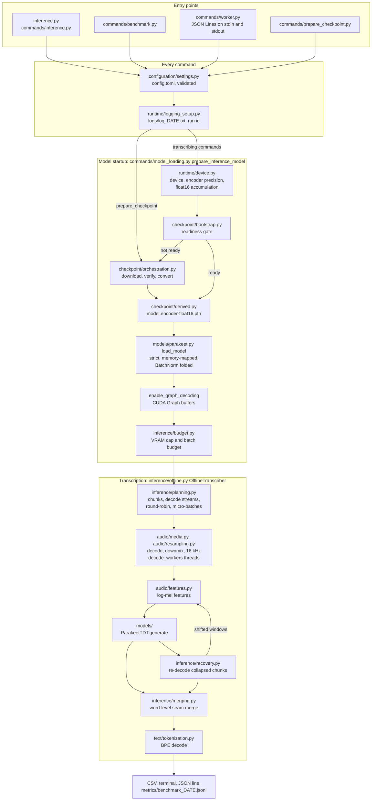
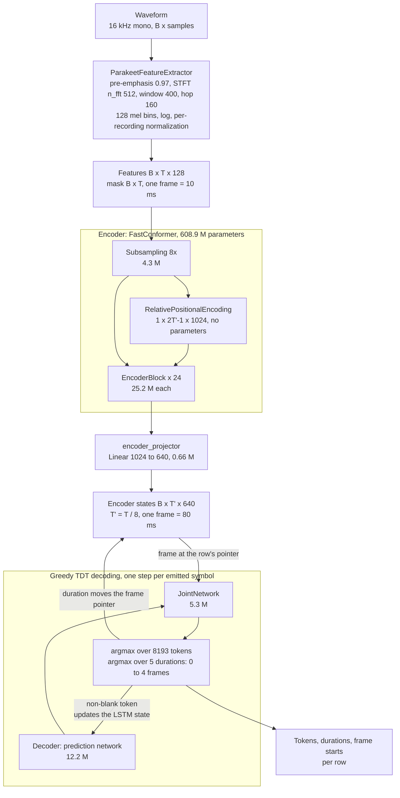
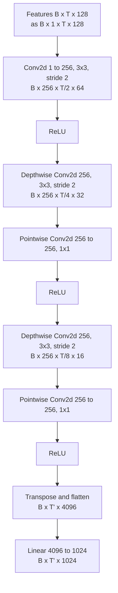
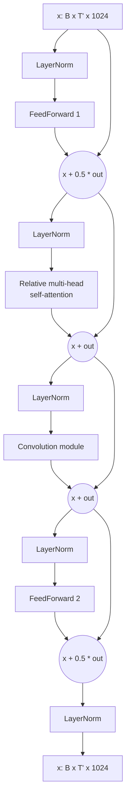
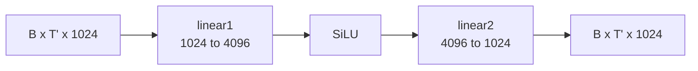
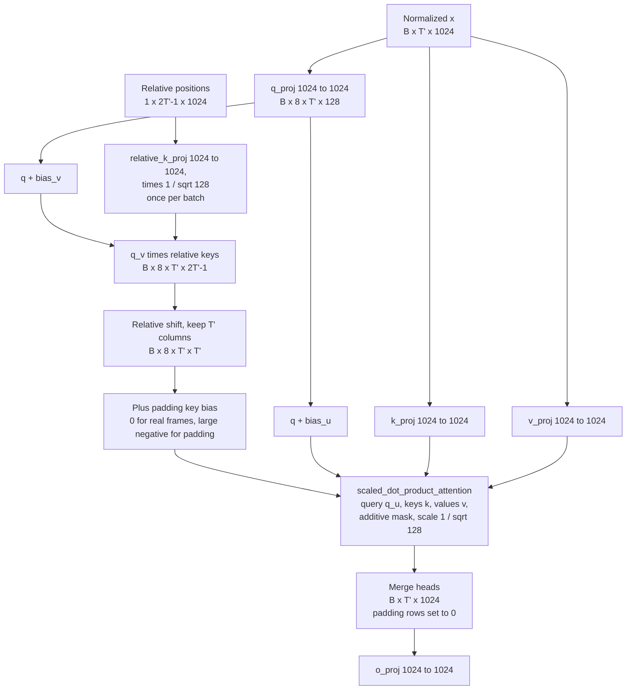
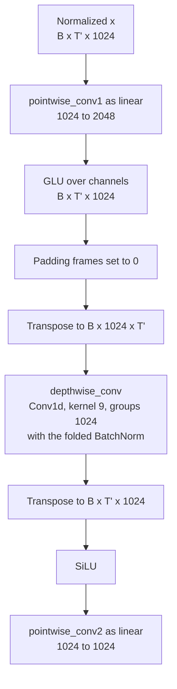
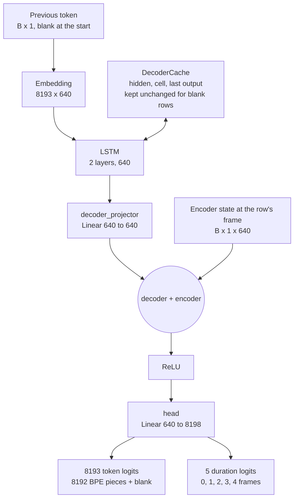
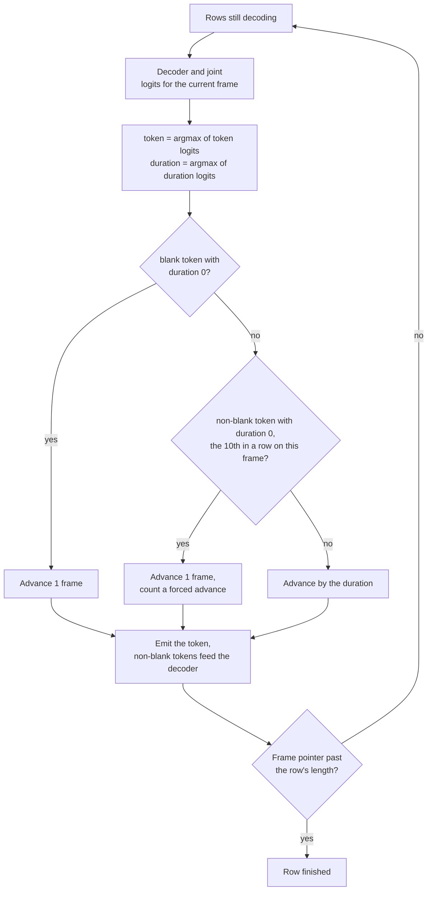

# ParakeetSTT

A standalone PyTorch runtime for NVIDIA's [Parakeet TDT 0.6B v3](https://huggingface.co/nvidia/parakeet-tdt-0.6b-v3) speech-to-text model.

The model is reimplemented module by module in plain PyTorch. At runtime it does not use NeMo, Hugging Face Transformers, torchaudio, or torchcodec. You give it one audio file or a folder of files, of any length. It downloads and verifies the checkpoint on first use, splits long recordings into memory-bounded chunks, batches work across files, and writes a transcript per file with an explicit status.

Output parity with the reference implementation was verified token-for-token and text-for-text against Hugging Face `ParakeetForTDT` on 15 test clips (float32 encoder). The default float16 encoder gives the same word error rate on labeled long recordings; see [Measured performance](#measured-performance).

## Contents

- [What the model is](#what-the-model-is)
- [Architecture](#architecture)
- [Requirements](#requirements)
- [Installation](#installation)
- [Quick start](#quick-start)
- [Output](#output)
- [Configuration](#configuration)
- [Supported input](#supported-input)
- [How long audio is processed](#how-long-audio-is-processed)
- [Measured performance](#measured-performance)
- [Benchmarking](#benchmarking)
- [Worker for many short files](#worker-for-many-short-files)
- [Checkpoint preparation](#checkpoint-preparation)
- [Logs](#logs)
- [Running the tests](#running-the-tests)
- [Project layout](#project-layout)
- [Known limitations](#known-limitations)
- [License and attribution](#license-and-attribution)

## What the model is

| Property | Value |
|---|---|
| Checkpoint | `nvidia/parakeet-tdt-0.6b-v3` |
| Parameters | about 627 million |
| Encoder | FastConformer, 24 layers, hidden size 1024, 8 attention heads, relative positional attention |
| Front end | 128-bin log-mel features at 16 kHz (25 ms window, 10 ms hop), 8x convolutional subsampling (one encoder frame = 80 ms) |
| Decoder | 2-layer LSTM prediction network, hidden size 640 |
| Output | Token-and-Duration Transducer (TDT): each step predicts a token and a duration of 0 to 4 encoder frames |
| Vocabulary | 8192 SentencePiece-style BPE pieces plus one blank token; output includes punctuation and capitalization |
| Languages | 25 European languages: bg, cs, da, de, el, en, es, et, fi, fr, hr, hu, it, lt, lv, mt, nl, pl, pt, ro, ru, sk, sl, sv, uk (per the model card) |
| Weights license | CC-BY-4.0 (NVIDIA) |

Decoding is greedy. Beam search and language-model rescoring are not implemented.

## Architecture

The diagrams below are drawn from the code. [AGENTS.md](AGENTS.md#2-architecture) has the same model diagrams with precision, checkpoint names, and threading details.

### Codebase

Every command reads `config.toml` and opens the dated log first. The transcribing commands (CLI, benchmark, worker) then share one model startup (`commands/model_loading.py`), plan the work, and run it batch by batch; `prepare_checkpoint` only prepares the weights.



### Model

Parakeet TDT 0.6B v3 has 627 million parameters: a FastConformer encoder, a projection, an LSTM prediction network, and a joint network that predicts a token and a duration at every step.



#### Subsampling

Three stride-2 stages shrink time and frequency by 8. After each convolution, frames past a row's length are zeroed, but only when the batch has rows of different lengths.



#### Encoder block (one of 24)

Each block is a Macaron FastConformer block: two half-weighted feed-forward branches around self-attention and a convolution branch, each with its own LayerNorm before it.



#### Feed-forward branch



#### Relative multi-head self-attention

Eight heads of size 128. The content score uses `bias_u` and the relative-position score uses `bias_v` (Transformer-XL style). The relative score and the padding mask go to PyTorch's scaled dot-product attention as one additive bias.



#### Convolution module

The two pointwise convolutions are 1x1 Conv1d weights in the checkpoint and run as linear layers. The BatchNorm is folded into the depthwise convolution when the model loads.



#### Prediction network and joint



#### One greedy TDT step



On CUDA the whole step runs as one replayed CUDA Graph (`models/graphed_decoding.py`), with the same results as the step-by-step loop.

## Requirements

- **Python 3.11 or newer.** The code uses `tomllib` and `enum.StrEnum`. It was developed and tested with Python 3.13.
- **PyTorch.** Any build for your platform: CUDA, Apple MPS, or CPU. The device is chosen automatically. Development used PyTorch 2.14 with CUDA 13.2.
- **soundfile** (libsndfile) for decoding WAV, FLAC, OGG, MP3 and the other formats libsndfile supports. It installs NumPy with it.
- **FFmpeg (optional).** Only needed for formats libsndfile cannot read, such as M4A/AAC, Opus in MP4/WebM, or audio inside video files. `ffmpeg` and `ffprobe` are found through `PATH`, or through the `FFMPEG_BINARY` and `FFPROBE_BINARY` environment variables.
- **Disk:** about 6.2 GB for the checkpoint directory: the 2.5 GB `model.safetensors` download, the 2.5 GB converted `model.pth`, and the 1.2 GB `model.encoder-float16.pth` built from it on the first float16 run.
- **GPU memory:** with the default float16 encoder the weights take about 1.2 GB on the device (2.4 GB in float32). Transcription peaked at about 2.0 GB with the default settings on a 4 GB laptop GPU; the batch size adapts to the free memory. See [Measured performance](#measured-performance).

## Installation

1. Clone the repository and create a virtual environment:

   ```powershell
   git clone https://github.com/JohanesSetiawan/ParakeetSTT.git
   cd ParakeetSTT
   python -m venv venv
   ```

2. Install PyTorch for your platform using the selector at [pytorch.org](https://pytorch.org/get-started/locally/). Keep the index URL it gives you and add `--no-cache-dir`.

3. Install the runtime dependencies (and, to run the tests, the development ones):

   ```powershell
   venv\Scripts\python.exe -m pip install -r requirements.txt --no-cache-dir
   venv\Scripts\python.exe -m pip install -r requirements-dev.txt --no-cache-dir
   ```

4. Optionally install FFmpeg and make sure `ffmpeg` and `ffprobe` are on `PATH`.

On Linux or macOS, use `venv/bin/python` instead of `venv\Scripts\python.exe`.

## Quick start

Transcribe one file. The transcript is printed to the terminal:

```powershell
venv\Scripts\python.exe inference.py --transcribe path\to\audio.mp3
```

Transcribe every audio file in a folder. The results are written to `transcriptions.csv` inside that folder:

```powershell
venv\Scripts\python.exe inference.py --transcribe path\to\folder
```

`--transcribe` is the only argument. Everything else is set in `config.toml`.

The first run downloads the checkpoint from Hugging Face, verifies every file against pinned hashes, converts it to `model.pth`, builds the float16 encoder file, and writes a readiness marker. Later runs skip all of that.

For many short files sent one at a time, keep a [worker](#worker-for-many-short-files) running instead: each `inference.py` run spends about 5 s on startup.

A folder run prints plain-text progress. This example is the five test clips in `tests/data/librispeech/` on an RTX 3050 Ti Laptop GPU:

```text
Run id: 44ddd8e4ed21
Log file: ...\logs\log_2026-10-06.txt
Weights: ready
Device: cuda:0
Accelerator: CUDA
Device count: 1
Device name: NVIDIA GeForce RTX 3050 Ti Laptop GPU
Precision: float16
PyTorch: 2.14.0+cu132
CUDA runtime: 13.2
Python: 3.13.13
Encoder precision: float16 encoder, float32 decoder and joint
Model load seconds: 2.115
CUDA Graph decoding: on
Accelerator memory ceiling: 2990 MiB
Memory per full chunk: 55 MiB, full chunks that fit: 30
Batch feature frames: 24000 (configured 24000)
Transcribing 5 file(s)
Batch: 1 / 6, Progress: 16.67 percent, Elapsed: 0.1 s, ETA: 0.6 s
Batch: 6 / 6, Progress: 100.00 percent, Elapsed: 0.6 s, ETA: 0.0 s
CSV: ...\transcriptions.csv
Files: 5
File statuses: ok=5
Total audio seconds: 46.630
Wall-clock seconds: 0.591
Media decode seconds: 0.022
Feature extraction seconds: 0.026
Model generation seconds: 0.549
Real-time factor: 0.012674
Throughput audio seconds per second: 78.902
Work items: 7, batches: 6
Peak accelerator memory allocated: 1313.0 MiB
Peak process memory: 1958.2 MiB
```

- `Accelerator memory ceiling` is the most PyTorch may hold on the GPU (see [`[memory]`](#memory)); `Memory per full chunk` and `full chunks that fit` are measured at startup and set the batch size.
- `Peak process memory` is the largest resident memory of the whole process so far (peak working set on Windows, peak RSS elsewhere). Most of it is the memory-mapped checkpoint while it is copied to the GPU.

## Output

### Single file

The terminal shows `Status:`, `Transcript:`, the audio duration, and the same timing summary as a folder run.

### Folder

`transcriptions.csv` is UTF-8 with this header:

```text
path_audio,filename_audio,duration_audio,status,transcription
```

- There is one row per file, sorted by path. With `recursive = true`, subfolders are included.
- `duration_audio` is in seconds and is empty for unreadable files.
- An existing `transcriptions.csv` in the folder is never treated as input.
- The CSV is written atomically: the new file replaces the old one only once it is complete.
- If the CSV cannot be written (for example, it is open in Excel on Windows), the rows are saved to `logs/transcriptions_<run id>.csv` instead. The command then reports this and exits with code 1.

### Status values

Every file gets exactly one status. When a file has several conditions, the most severe one wins, in the order of this table.

| Status | Meaning | What to do |
|---|---|---|
| `numerical_failure` | Features or encoder states were NaN/Inf for at least one chunk. The tokens from that chunk were discarded. | Report it; this should not happen with valid audio. |
| `input_nonfinite` | The decoded audio contained NaN/Inf samples. They were replaced with zeros before inference. | Check the source file. |
| `decoder_forced_advance` | The decoder emitted too many tokens on one frame and a safety guard forced it forward. Part of the transcript comes from a degenerate decoding loop. | Listen to the audio; the transcript may contain junk. |
| `untranscribed_gap` | A stretch of more than `untranscribed_gap_seconds` of non-silent audio produced no words, even after re-decoding with shifted windows (see [How long audio is processed](#how-long-audio-is-processed)). The rest of the transcript is normal. | Listen to that stretch; it is often laughter, music, or noise, but it may be missed speech. The log gives its position. |
| `no_speech` | Every chunk was digital silence (all-zero samples). | Nothing. |
| `empty_transcript` | The audio was not silent, but no token was produced (noise, music, or speech too short). | Check whether the file contains speech. |
| `unreadable` | Neither libsndfile nor FFmpeg could read the file. No transcript was attempted. | Install FFmpeg, or convert the file. |
| `ok` | A normal transcript. | |

The exit code is 0 when the run completes, including files with review statuses, which are summarized in a `Warning:` line. It is 1 when the run fails or the CSV had to go to the fallback location.

## Configuration

All settings live in `config.toml` at the repository root. Every key is required. Invalid values are rejected at startup, before the model loads, with the offending `section.key` in the error message. Relative paths are resolved against the repository root, not the current directory.

### `[paths]`

| Key | Default | Meaning |
|---|---|---|
| `weights_dir` | `"weights/parakeet-tdt-0.6b-v3"` | Checkpoint directory: downloads, `model.pth`, manifests, readiness marker. |
| `log_dir` | `"logs"` | Directory for dated run logs and fallback CSVs. |
| `metrics_dir` | `"metrics"` | Directory for benchmark results (see [Benchmarking](#benchmarking)). |

### `[logging]`

| Key | Default | Meaning |
|---|---|---|
| `level` | `"INFO"` | `DEBUG`, `INFO`, `WARNING`, or `ERROR`. `DEBUG` adds a line per batch with its items, frame counts, and stage timings. |

### `[checkpoint]`

| Key | Default | Meaning |
|---|---|---|
| `request_timeout_seconds` | `120.0` | Timeout per HTTP request. Must be greater than 0. |
| `download_attempts` | `3` | Attempts per file for network failures. At least 1. |
| `retry_backoff_seconds` | `2.0` | The wait before attempt N is this value times (N - 1). |
| `stream_block_bytes` | `1048576` | Read size while streaming and hashing downloads. |

### `[inference]`

| Key | Default | Meaning |
|---|---|---|
| `batch_size` | `16` | Maximum chunks per micro-batch. |
| `recursive` | `true` | Include subfolders in folder mode. |
| `output_filename` | `"transcriptions.csv"` | CSV name inside the input folder. Must be a plain file name. |
| `audio_extensions` | `[]` | Optional suffix allow-list such as `[".wav", ".mp3"]`. Empty means every file is probed by content. |
| `max_chunk_feature_frames` | `1500` | Hard limit on one chunk's feature frames, including overlap. At a 10 ms hop that is 15 s of audio. |
| `overlap_feature_frames` | `50` | Context added on each side of a chunk (0.5 s). May be 0. `max_chunk_feature_frames` must be greater than twice this value. |
| `max_batch_feature_frames` | `24000` | Upper limit on a batch's padded size: rows times the longest row. Must be at least `max_chunk_feature_frames`. With `memory.auto_batch_budget` it is lowered at startup to what fits in the free GPU memory, never raised. |
| `max_padding_fraction` | `0.25` | The largest share of a batch that may be padding, between 0 and 1. |
| `merge_tolerance_feature_frames` | `100` | How far apart (1.0 s) two neighboring chunks may place the same word and still be recognized as one word at the seam. `0` disables seam alignment. |
| `untranscribed_gap_seconds` | `4.0` | A stretch of a chunk this long with no word, and not silent, is treated as a possible decoder collapse and re-decoded. |
| `gap_silence_rms` | `0.001` | RMS below which such a stretch counts as silence (about -60 dBFS) and is left alone. |
| `recovery_start_offsets_feature_frames` | `[-25, 25, -50, 50]` | Window-start shifts tried, in order, when re-decoding a collapsed chunk. Each must be at most `overlap_feature_frames` in size. An empty list disables recovery. |
| `progress_interval_seconds` | `2.0` | Minimum time between two progress lines. The final line is always printed. |
| `max_open_files` | `8` | Most multi-chunk files decoded at the same time. Each holds up to `decode_workers` open decoders (file handles, or `ffmpeg` processes) and their overlap tails until its last chunk; the more files are in progress, the fewer decoders each gets. Single-chunk files do not count. At least 1. |
| `encoder_precision` | `"float16"` | `"float16"` or `"float32"`. Float16 runs the encoder about 2.8 times faster and halves its weights; the decoder and joint stay float32. Used on CUDA only; CPU and MPS run float32. |
| `cuda_graphs` | `true` | Replay each greedy decoding step as one captured CUDA Graph instead of about 46 kernel launches. Same output; CUDA only. |
| `float32_matmul_precision` | `"highest"` | `"highest"` (exact float32) or `"high"` (TF32 tensor cores on NVIDIA Ampere and newer). With `encoder_precision = "float32"`, `"high"` was 13% faster end to end with the same word error rate. |
| `float16_accumulation` | `true` | With the float16 encoder on CUDA, matrix products also add in float16. The encoder ran 1.17 times faster, and corpus word error rate was 6.66% against 6.67% without it. Ignored for a float32 encoder. |
| `decode_workers` | `4` | Threads that decode and resample audio while the GPU runs. A long file's chunks are dealt to several decoders in blocks, so each batch is decoded in parallel; chunks of different files are decoded in parallel too. At least 1. |

### `[memory]`

GPU only; CPU and MPS ignore it.

| Key | Default | Meaning |
|---|---|---|
| `cap_to_free_memory` | `true` | After loading, cap PyTorch's GPU allocator at the memory that is actually free. On Windows the NVIDIA driver otherwise moves allocations that do not fit in VRAM into shared system memory, and the run continues several times slower instead of failing. |
| `auto_batch_budget` | `true` | Measure one and three full chunks at startup and lower `inference.max_batch_feature_frames` to what fits under the cap. |
| `reserve_mib` | `256` | GPU memory to leave free under the cap, for kernels loaded later and other programs. When less than this is free, the run uses the physically free memory and prints a warning instead of refusing. At least 0. |

If not even one full chunk fits in the free GPU memory, the run stops before the first batch and says so. Close other programs that use the GPU, or lower `inference.max_chunk_feature_frames`. If a run still stops with an out-of-memory error, raise `reserve_mib` or lower `inference.max_batch_feature_frames`; the error message names these keys.

### `[benchmark]`

Used only by the development benchmark command, not by transcription.

| Key | Default | Meaning |
|---|---|---|
| `warmup_rounds` | `1` | Rounds run and discarded before measuring (CUDA kernel selection, file cache). At least 0. |
| `measured_rounds` | `3` | Rounds that are timed and compared. At least 1. |
| `git_timeout_seconds` | `30.0` | Limit for each git query that records the commit. On timeout the commit is recorded as unknown (null) instead of blocking the run. Greater than 0. |

## Supported input

libsndfile handles WAV (PCM and float), FLAC, OGG/Vorbis, MP3 and the other formats it supports. It is always tried first. Any other file is probed with `ffprobe` and decoded with `ffmpeg`.

- **Channels:** multi-channel audio is averaged to mono.
- **Sample rate:** any rate is resampled to 16 kHz with an anti-aliased windowed-sinc filter, so content above 8 kHz is removed instead of folding into the speech band. With 9 to 15 kHz hiss mixed into 48 kHz speech, word error rate stayed at 3.7% (the clean value); the old linear interpolation reached 15.6%.
- **Non-finite samples:** NaN/Inf samples are replaced with zero and reported as `input_nonfinite`.
- **FFmpeg decoding:** each decoder of a file runs one `ffmpeg` process that decodes to 16 kHz mono in order, and each chunk continues exactly where the previous one stopped. Overlap regions are reused, not decoded again. When the decoder moves on to its next block of chunks, `ffmpeg` is started again at that position instead of decoding the audio in between. A non-zero `ffmpeg` exit stops that file with the last lines of its error output.
- **Missing FFmpeg:** if `ffprobe` is not installed, formats libsndfile cannot read are reported as `unreadable` and the rest of the folder is still processed.
- **Misconfigured FFmpeg path:** if `FFMPEG_BINARY` or `FFPROBE_BINARY` is set but points to a missing file, the run stops. That is treated as a setup error, not a property of one file.

## How long audio is processed

There is no duration limit, and memory use does not grow with the length of the recording.

1. **Planning.** Each file is cut into chunks. A chunk has a core that it owns, plus up to `overlap_feature_frames` of context on each side. The planner sizes chunks by the exact STFT frame count, `samples // 160 + 1`, so no chunk exceeds `max_chunk_feature_frames`.
2. **Scheduling.** Chunks from all files are interleaved round-robin, so one long file cannot delay every short file behind it. At most `max_open_files` multi-chunk files are in progress at once; the next starts when one finishes, and single-chunk files are never held back. Chunks are then packed into micro-batches bounded by `batch_size`, by the padded size `max_batch_feature_frames` (after the memory budget), and by `max_padding_fraction`.
3. **Decoding.** Audio for the next batch is decoded while the GPU processes the current one, by `decode_workers` threads. A long file's chunks are dealt to several decoders in blocks (with 16-row batches and 4 workers: chunks 0-3, 4-7, 8-11 and 12-15 to four decoders, then 16-19 to the first again), so every batch is read by four threads that all start near the beginning of the file. Each decoder keeps its handle open from its first chunk to its last, reuses the overlap a chunk shares with the previous one, and seeks forward between blocks. Every chunk is read with half a second of extra audio on each side, the reach of the recovery windows. Only the current and next batch and one overlap tail per decoder are held in memory.
4. **Inference.** Each batch goes through feature extraction, the encoder (float16 by default), and greedy TDT decoding on the selected device. On CUDA each decoding step is one replayed CUDA Graph.
5. **Collapse recovery.** On rare windows the model skips seconds of clear speech and emits nothing. The Hugging Face reference does the same on the same samples, so it is a property of the model. Moving the window start by a few hundred milliseconds usually fixes it. A chunk with a long non-silent stretch and no words is re-decoded with the shifted windows from `recovery_start_offsets_feature_frames`, and the first result without the gap is used. If none works, the file gets the status `untranscribed_gap`. The windows are cut from the audio read with the chunk, so recovery never reads the file again. They are tried in order, one per chunk per batch (most chunks recover with the first), and run between planned batches as soon as a full batch of them is waiting; the rest run after the last planned batch.
6. **Merging.** Tokens are grouped into words and a word is never split between chunks. In the overlap, the words both chunks agree on are taken once, from the chunk with more context at that point. Neighboring chunks can place the same word up to about half a second apart, so agreement is checked within `merge_tolerance_feature_frames`. Without agreement, each whole word goes to the chunk whose core holds its start. Repeated words are kept as spoken; nothing is corrected against a word list.

The batch budget is fitted to the free GPU memory before the first batch (see [`[memory]`](#memory)). If the accelerator still runs out of memory, the run stops with a diagnostic. It does not retry, shrink the batch, fall back to CPU, or write a partial CSV.

## Measured performance

These numbers come from one machine: an NVIDIA GeForce RTX 3050 Ti Laptop GPU with 4 GB, PyTorch 2.14 + CUDA 13.2, Windows 11, and default settings (float16 encoder, CUDA Graph decoding, automatic batch budget). They show what this hardware achieved, not a guarantee for other hardware. A laptop GPU's clock also varies with temperature by several percent between runs.

| Workload | Audio | Wall-clock | Real-time factor | Peak VRAM allocated |
|---|---|---|---|---|
| One MP3, 48 kHz stereo | 36 min (2163 s) | 4.0 s | 0.0019 | 2033 MiB |
| One MP3, 48 kHz stereo | 74 min (4420 s) | 7.9 s | 0.0018 | 2033 MiB |
| The 36-minute recording as M4A (AAC, through FFmpeg) | 36 min (2163 s) | 4.1 s | 0.0019 | 2033 MiB |
| Folder: 15 short WAV + both MP3s, benchmark command, 3 rounds | 112.6 min | 11.92 s (spread 0.23 s) | 0.0018 | 2033 MiB |

The same 112.6-minute folder took 97.4 s with the earlier float32 settings (2 chunks per batch, no CUDA Graph, no decode prefetch), and 19.06 s before parallel decoding, float16 accumulation, the leaner encoder, and in-memory collapse recovery. Word error rate against the labeled transcripts in that folder:

| Settings | Corpus WER | 36-min podcast | 74-min podcast |
|---|---|---|---|
| Default (float16 encoder, float16 accumulation) | 6.66% | 7.39% | 6.29% |
| Before this release's speed changes (float16 encoder) | 6.67% | 7.42% | 6.29% |
| `encoder_precision = "float32"` | 6.63% | 7.43% | 6.22% |
| Hugging Face `ParakeetForTDT` pipeline, 15 s chunks without overlap | | 9.94% | 8.45% |

The Hugging Face pipeline's default chunking (with overlap) repeats the overlapped speech in its transcript (52% WER) and cannot run either podcast in one piece on a 4 GB card (it ran out of memory above 3 minutes).

- **Where the time goes** (112.6-minute folder): generation 10.1 s, mostly the encoder (per 16-chunk batch about 0.27 s of encoder against about 0.05 s of graph-replayed decoding loop); media decoding about 6.5 s of batch time on four threads, hidden behind the GPU work; collapse recovery about 0.7 s (14 of 486 chunks re-decoded). The GPU is the limit: the 74-minute file spends 6.5 s of its 7.9 s in the model.
- **Short files:** one `inference.py` run on a 9-second clip takes about 6 s, almost all of it startup. The [worker](#worker-for-many-short-files) answered such clips in 0.12 s each after a 5.2 s start.
- **Model load:** about 2.1 s once the checkpoint and its float16 file are prepared and in the OS cache.
- **Memory does not grow with length:** peak VRAM was the same for the 36- and 74-minute files.
- **Process memory:** about 2.0 GB peak, most of it the memory-mapped checkpoint while it is copied to the GPU.

CPU and Apple MPS execution is supported by the code but has not been benchmarked.

## Benchmarking

For development, a separate command times the real pipeline repeatably:

```powershell
venv\Scripts\python.exe -m src.commands.benchmark --input path\to\audio_or_folder
```

It loads the model once and reports that cold start on its own. It then runs `[benchmark] warmup_rounds` transcriptions that are discarded, and `measured_rounds` that are timed. Nothing is written next to the audio. Each run appends one JSON line to `<metrics_dir>/benchmark_<YYYY-MM-DD>.jsonl` with:

- the git commit and whether the working tree had uncommitted changes;
- the device report, encoder precision, whether CUDA Graph decoding was on, the memory budget, and the `[inference]` (after the budget), `[memory]`, and `[benchmark]` settings;
- the input (files, audio seconds, unreadable files);
- the cold start (weights action, bootstrap and load seconds);
- every measured round: wall, media decode, feature, generation, and recovery seconds, real-time factor, work items, batches, peak accelerator memory, and per-file status, chunks, recovered chunks, processing seconds, and real-time factor;
- mean, min, max, and standard deviation of wall and generation seconds;
- whether every round produced the same transcripts;
- the peak process memory.

To compare two commits, run both on the same input and compare the summaries. A laptop GPU's clock varies with temperature, so a difference smaller than the spread between rounds is noise.

## Worker for many short files

A program that transcribes many short files (a labeling tool, an editor plugin) can keep one worker process running and pay the model startup once:

```powershell
venv\Scripts\python.exe -m src.commands.worker
```

It reads one JSON object per line on standard input, as UTF-8, and answers with one JSON object per line on standard output. Responses are plain ASCII: other characters in paths and transcripts are written as JSON `\u` escapes, which every JSON parser decodes, so a console code page cannot corrupt them. Startup messages go to standard error.

Sending one request for a test clip (the path shortened here):

```text
-> {"path": "tests/data/librispeech/1272-128104-0000.flac", "id": 1}
<- {"event": "ready", "run_id": "87a8888c4cf0", "device": "cuda:0", "precision": "float16 encoder, float32 decoder and joint", "graph_decoding": true, "load_seconds": 2.056}
<- {"event": "transcript", "id": 1, "path": "...\\tests\\data\\librispeech\\1272-128104-0000.flac", "status": "ok", "transcript": "mister Quilter is the apostle of the middle classes, and we are glad to welcome his gospel.", "duration_seconds": 5.855, "processing_seconds": 0.098}
<- {"event": "done", "id": 1, "files": 1, "wall_seconds": 0.103}
```

- The first line the worker writes is the `ready` event, before any request is read.
- `path` may be a file or a folder; a folder follows `inference.recursive` and `inference.audio_extensions`, and its files are batched together. `id` is optional and echoed back.
- Unreadable files are answered with `"status": "unreadable"` and an `error`, followed by `done`, also when no file of the request was readable.
- A request that cannot be served (a line that is not UTF-8 or not a JSON object with a string `path`, a path that does not exist, an out-of-memory batch) is answered with `{"event": "error", "id": ..., "error": "..."}`, and the worker keeps serving.
- The worker stops at end of input. Everything is also written to the dated run log.

## Checkpoint preparation

This runs automatically on the first transcription. You can also run it on its own:

```powershell
venv\Scripts\python.exe -m src.commands.prepare_checkpoint
```

It prepares `weights_dir` as follows:

1. **Download.** It downloads `config.json`, `generation_config.json`, `processor_config.json`, `tokenizer.json`, `tokenizer_config.json`, and `model.safetensors` from Hugging Face. Each file streams to a temporary file and replaces the target only after it passes verification.
2. **Verify.** Each file is checked against a size and hash pinned in `src/checkpoint/download.py`: SHA-256 for the weights, Git blob SHA-1 for the JSON files. A file that doesn't match is rejected. Files that already match are reused, and only missing or corrupted files are downloaded again.
3. **Convert.** It converts `model.safetensors` into `model.pth`, reading tensor by tensor with bounded memory. It checks that all required keys are present, that no weight is NaN/Inf, and that the vocabulary and output dimensions match.
4. **Record.** It writes `download_manifest.json` and `conversion_manifest.json`, so unchanged artifacts are never converted twice.
5. **Mark ready.** The inference command strict-loads the model. Only when that succeeds does it write `.ready`, which records the size of `model.pth`.

On every later run the fast path checks only that `.ready` exists and that `model.pth` still has the recorded size. A deleted, truncated, or replaced checkpoint triggers a full preparation again. To force one, delete `weights_dir/.ready`.

With the float16 encoder, the first run also builds `model.encoder-float16.pth` from `model.pth` and records it in `model.encoder-float16.json`. Loading that file reads half the bytes and peaks at about 2.0 GB of process memory instead of 4.2 GB. It is current only while `model.pth` is the same file it was built from (same size and modification time), and re-converting `model.pth` deletes it, so it is rebuilt automatically after any replacement or repair, or when it is incomplete; delete both files to force a rebuild. If the weights folder cannot be written (a read-only install), the run prints a warning and casts `model.pth` to float16 in memory instead, with the same result and a higher memory peak while loading.

Checkpoints are loaded with `torch.load(..., weights_only=True)`, which refuses arbitrary pickled objects. For a GPU or MPS run the file is memory-mapped (`mmap=True`) instead of copied into private memory; on the CPU it is copied, because the loaded tensors are the model itself and a mapping would keep the file open, and on Windows impossible to replace, for as long as the process runs.

## Logs

Every run appends to `logs/log_<YYYY-MM-DD>.txt`. Each line carries the run id printed at startup:

```text
<timestamp> <LEVEL> run=<run id> <module>: <message>
```

A run logs:

- the input and mode
- the checkpoint action
- the device report, encoder precision, and CUDA Graph decoding
- the model load time
- the memory ceiling and batch budget
- the plan (files, work items, batches)
- one line per file (status, duration, chunks, word count, processing seconds, real-time factor)
- unreadable files
- full tracebacks on failure

Transcripts themselves are not written to the log.

A file's processing seconds are its own media decoding plus a share of each batch's feature and generation time, split by feature frames, plus any collapse re-decodes. Batches mix files, so this is an attribution, not a separately timed run.

## Running the tests

The suite uses pytest (`requirements-dev.txt`) and has three tiers, selected by directory:

| Tier | Directory | What it needs | What it checks |
|---|---|---|---|
| `unit` | `tests/unit/` | nothing (tiny fixture checkpoint, CPU) | planner, features, TDT loop and its static-buffer (CUDA Graph) form, media decoding, merge, statuses, settings, memory budget, float16 checkpoint file, worker protocol, checkpoint download and conversion against a local HTTP server, CLI |
| `regression` | `tests/regression/` | nothing | one test per defect that was found and fixed, each naming the fixing commit |
| `full` | `tests/full/` | the prepared checkpoint | real speech end to end with the configured precision: exact transcripts, word error rate, batching and determinism, long-form memory bound, no empty chunks in full batches, captured CUDA Graph against the eager loop, the memory budget on the GPU, the real `inference.py` command and worker process, and parity with Hugging Face `ParakeetForTDT` (when `transformers` is installed) |

```powershell
venv\Scripts\python.exe -m pytest                     # everything
venv\Scripts\python.exe -m pytest -m "not full"       # fast suite, no checkpoint needed
venv\Scripts\python.exe -m pytest -m full             # real checkpoint and speech only
```

The `full` tier uses five LibriSpeech clips committed under `tests/data/librispeech/` (CC BY 4.0; see `SOURCE.md` there). If the checkpoint has not been prepared, the whole tier is skipped with a message rather than downloading it.

Two optional checks use your own recordings, which stay outside the repository:

- `PARAKEET_TEST_LONG_AUDIO`: long recordings to run through the long-form checks, separated by `;` on Windows or `:` elsewhere.
- `PARAKEET_TEST_REFERENCE_DIR` and `PARAKEET_TEST_REFERENCE_MAX_WER`: a folder with audio files and a `transcript.txt` of `<file name><tab or spaces><reference text>` lines, and a corpus word error rate budget in percent. The test also fails when a long transcript's length is far from its reference (text repeated at seams) or when more than 10% of chunks needed collapse recovery.

```powershell
$env:PARAKEET_TEST_REFERENCE_DIR = "D:\labeled"; $env:PARAKEET_TEST_REFERENCE_MAX_WER = "7.0"
venv\Scripts\python.exe -m pytest tests\full\test_reference_long_form.py -s
```

On the development machine the full suite takes about 55 seconds.

## Project layout

```text
inference.py                  Command launcher (python inference.py --transcribe ...)
config.toml                   All runtime settings
src/
  audio/                      Media probing and decoding (media.py), resampling (resampling.py), log-mel features (features.py)
  checkpoint/                 Download and verification, safetensors -> model.pth, readiness marker, float16 encoder file (derived.py)
  commands/                   Entry points (inference.py, prepare_checkpoint.py, benchmark.py, worker.py), shared model startup (model_loading.py), progress reporting
  configuration/              Checkpoint JSON validation (config.py), config.toml settings (settings.py)
  inference/                  Chunk planning (planning.py), orchestration (offline.py), seam merging (merging.py), collapse recovery (recovery.py), memory budget (budget.py)
  models/                     Subsampling, attention, Conformer blocks, encoder, LSTM decoder, joint, TDT loop, CUDA Graph decoding (graphed_decoding.py)
  runtime/                    Device selection and report, dated logging, atomic file writes, process and GPU memory
  text/                       Tokenizer decoding from tokenizer.json
tests/
  unit/                       Fast isolated tests (tiny fixture checkpoint)
  regression/                 One test per fixed defect
  full/                       Real checkpoint and real speech, end to end
  data/librispeech/           Five CC BY 4.0 speech clips with expected transcripts
```

[AGENTS.md](AGENTS.md) documents the architecture, invariants, and development rules in depth.

## Known limitations

- **Chunking still costs a little accuracy.** On the test clips, word error rate is 3.7% when each clip is transcribed alone and 4.6% when the same speech is one 196-second recording cut into 15 chunks. Each chunk sees less context than the whole recording.
- **Decoder collapse cannot always be recovered.** The first chunk of a file has no earlier audio to shift into, and some windows stay collapsed at every tried shift. Such files are marked `untranscribed_gap` rather than passed off as complete.
- **Float16 is not token-identical across batch shapes.** The transcript text of each test clip is the same alone and in a mixed batch, but a blank or a duration can move by one frame. With `encoder_precision = "float32"` every token and duration is identical.
- **cuDNN float16 depthwise convolution:** in cuDNN 9.24 it returned wrong values for some inputs in batches of 7 or more rows, emptying whole chunks. The depthwise convolutions therefore always run in float32; the cost is included in the numbers above.
- **Decoder blocks seek.** Each decoder seeks forward to its next block of chunks. An MP3 seek costs about 25 ms per 3 minutes skipped, which the parallel threads hide, and an `ffmpeg` restart starts at the requested time, which can be offset from a continuous stream by a few samples (a few milliseconds). Set `decode_workers = 1` to read every file as one continuous stream.
- **Without CUDA** there is no CUDA Graph decoding and the encoder runs in float32, so CPU and MPS are much slower; neither has been benchmarked.
- **Scope:** the runtime does offline transcription only. There is no streaming, speaker diarization, word-level timestamps in the output, beam search, or language-model rescoring.
- **Language:** the model has no language selection. It transcribes whatever it recognizes among its 25 languages.

## License and attribution

The source code in this repository is licensed under the [Creative Commons Attribution 4.0 International License (CC-BY-4.0)](https://creativecommons.org/licenses/by/4.0/), the same license NVIDIA uses for the model. The full legal text is in [LICENSE](LICENSE). Copyright (c) 2026 Johanes Setiawan.

The model weights are a separate work: NVIDIA publishes them as [`nvidia/parakeet-tdt-0.6b-v3`](https://huggingface.co/nvidia/parakeet-tdt-0.6b-v3) under CC-BY-4.0. Using or redistributing the weights requires attribution to NVIDIA. This repository does not include the weights; they are downloaded from Hugging Face on first use.
